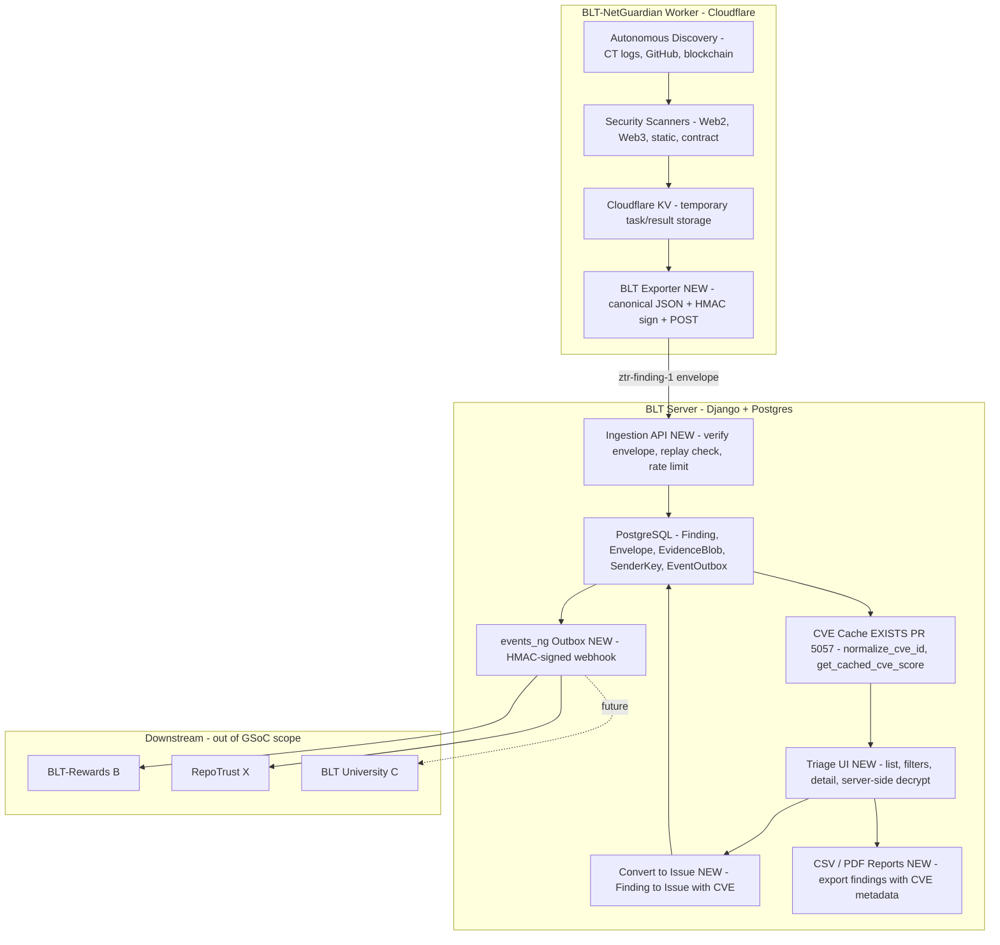

# NetGuardian — Technical approach & weekly deliverables (GSoC 2026)

> **Note for maintainers:** This is the **technical part only**. I'll add the SAT/personal sections (bio, coding skills, time commitment, etc.) once you're happy with this approach.

---

## 1. Introduction

This project extends work I've already contributed to OWASP BLT, including PR #5057 (CVE search, filtering, caching, autocomplete, and CVE-aware indexing on the Issue model), which is merged in the main repo. NetGuardian builds on that CVE layer and on the existing BLT-NetGuardian Worker (a Cloudflare Python Worker for autonomous discovery and scanning) to deliver a zero-trust ingestion path for security findings, CVE-aware triage, and verified events for downstream systems (Rewards, RepoTrust, University).

**Relationship to the existing BLT-NetGuardian Worker**

The Worker discovers targets (CT logs, GitHub API, blockchain) and runs security scanners (Web2, Web3, static, contract). Results stage in Cloudflare KV. This GSoC project doesn't rewrite the Worker. It connects that pipeline to BLT by:

1. Adding a BLT exporter in the Worker that converts scan results to signed ztr-finding-1 envelopes and POSTs to BLT.
2. Building BLT ingestion (`/api/ng/ingest`) with replay protection and Postgres storage.
3. Enriching findings via the PR #5057 CVE cache.
4. Adding a triage UI and "Convert to Issue".
5. Emitting HMAC-signed verified events for downstream.

The split is clean: the Worker handles discovery, scanning, and KV; BLT handles ingestion, triage, CVE enrichment, Issue creation, and events.

NetGuardian as a whole also includes a Flutter desktop client that lets users run the Worker locally on their own machines and send findings into BLT through the same signed ingestion API. In this proposal I focus on the server/Worker pipeline, but I’ll keep the Flutter client as a first-class entry point when designing APIs, auth, and UX.

**Prerequisites verified**

- Python 3.11+, Django 5.x dev environment.
- Access to the BLT main repo and BLT-NetGuardian Worker repo.
- Cloudflare Workers CLI (wrangler) for local Worker testing.
- PostgreSQL 14+ for local schema and management command testing.

---

## 2. Architecture, stack & key files

Worker already exists; GSoC adds the Exporter and all BLT-side pieces. Flow: Worker to KV to Exporter to signed envelopes to ingestion to CVE enrichment to triage UI to "Convert to Issue" to HMAC-signed webhook. No new queue; existing throttling only.

**Stack**

- BLT server: Django 5.x, Django REST Framework, PostgreSQL.
- Worker: Cloudflare Python Worker (existing, for autonomous scanning and KV storage).
- Client: Flutter desktop app that runs NetGuardian locally and talks to the BLT ingestion API.

**Architecture split**

- Detection and scanning: already implemented in BLT-NetGuardian Worker, no new detector code in GSoC scope.
- Ingestion API: new DRF endpoints in BLT (`/api/ng/ingest`, `/api/ng/ingest/batch`) reusing existing auth patterns (TokenAuthentication, org-scoped permissions, throttling middleware).
- Triage UI: server-rendered templates with HTMX, reusing existing BLT frontend patterns.
- Flutter client: runs NetGuardian locally and submits findings via the same ztr-finding-1 envelopes; main client implementation can evolve in parallel, but APIs/auth/flows are designed here so it’s a first-class entry point.
- No new infrastructure: no Celery, no separate worker daemons, no new queue systems. Periodic management commands (cron/Kubernetes CronJob) where needed; existing throttling middleware for rate limits.

**Key files**

- Worker (existing): `src/worker.py`, `src/scanners/*.py`, `src/models/*.py`, `ARCHITECTURE.md`, `API.md`.
- BLT (existing): `website/cache/cve_cache.py` (PR #5057) for `normalize_cve_id()` and `get_cached_cve_score()`; `website/models.py` for `Issue.cve_id` and `Issue.cve_score`; `blt/middleware/throttling.py` and `blt/middleware/ip_restrict.py` for rate limiting and IP controls; `website/views/user.py` for the HMAC pattern used by GitHub webhooks.
- BLT (new): `website/netguardian/` (models, views, templates for Finding, Envelope, EvidenceBlob, EventOutbox, triage UI, and ingestion endpoints).

---

## 3. Security invariants and design (ztr-finding-1)

Every envelope must carry `version`, `sender_id`, `issued_at` (UTC), `nonce`, `signature`, `payload_digest`, `alg`, and either `payload_ciphertext` or a `plaintext_mode` flag.

Signatures are HMAC-SHA256 over canonical JSON, chosen because it works natively in Cloudflare Workers without heavy crypto dependencies. Sign over the canonical JSON of the envelope with the signature field omitted (RFC 8785-style key ordering; UTF-8; no extra whitespace). Nonces MUST be unique per `sender_id`. The server enforces `unique(sender_id, nonce)` in the database and rejects replays within a ±5-minute `issued_at` window. Recommended nonce format: `<unix_ts>-<random>` (ordering is not required; uniqueness is). Ed25519 is on the table for future BLT-side verification but isn't needed for the Worker in this project.

For evidence, NetGuardian stores the encrypted bytes at rest (server-side keys), plus the SHA-256 digest and size. Neither ciphertext nor plaintext is ever logged, and templates/logs redact long or sensitive fields. Inbound inputs are normalized and length-capped before they touch anything. Max envelope body size: 1 MiB by default (org-configurable); requests exceeding the cap are rejected with 413 Payload Too Large. All Finding reads are org-scoped at the query level, evidence access requires an explicit permission check and gets logged every time, and "Convert to Issue" enforces both org ownership and rate limits before it goes through.

These invariants are treated as contracts: tests are written against them, and any refactor or library change has to preserve them.

---

## 4. 12-week implementation plan (phases 1-16)

**GSoC 12-week calendar**

See section 9 for how I plan to use AI across these phases; I keep this table focused on schedule and scope so it’s easier to scan.

| GSoC Week | Focus (phases) |
|-----------|----------------|
| 1 | Phases 1-2: envelope/schema + ingestion and zero-trust |
| 2 | Phase 3: BLT Exporter integration |
| 3 | Phase 4: Triage-lite UI |
| 4 | Phases 5-6: CVE plumbing + validation/dedup |
| 5 | Phase 7 + Phase 8 start: CVE-aware UX + polish |
| 6 | Phase 8: triage polish, RFIs, midterm E2E |
| 7 | Phase 9: Fidelity and acceptance gates |
| 8 | Phase 10: consensus and resilience |
| 9 | Phase 11: remediation and insights |
| 10 | Phase 12: disclosure and reports |
| 11 | Phase 13: verified events for downstream |
| 12 | Phases 14-16: hardening, pilot, v1.0 |

*Phase 5 is fast (~2 days) because it reuses the existing CVE cache utilities from PR #5057. It is paired with Phase 6 in Week 4 to keep the 12-week timeline realistic. Phase numbers are implementation milestones, not weeks; the table above shows how 16 named phases map onto 12 GSoC weeks.*

---

### Phase 1 — Envelope and schema

**Weekly deliverables**

Task:- locking the envelope format and data model so everything that follows has a clear contract.

- A written ztr-finding-1 spec covering fields, signatures, timestamps, and nonces, detailed enough that someone else could implement against it without coming back with questions.
- Database/ORM models for Finding, Envelope, EvidenceBlob, and SenderKey with migrations applied and everything wired into admin.
- A key registry model (per-org/per-sender) with `kid` for rotation and a clear approach to nonce uniqueness, either a DB table or a cache-key pattern, decided and documented.
- Pagination defaults and a DB index strategy for findings written down now, so we're not improvising under pressure later.
- Serializer stubs for Finding/Envelope and unit tests covering model constraints and validation.

**AI use**

The main thing I need AI for here is getting a first draft of the ztr-finding-1 spec on paper quickly. Claude Opus 4.5 handles proposing field names and structure, which I then tighten until another implementer could use it without ambiguity. For the serializer skeletons and pytest fixtures, Claude Sonnet 4.5 handles the repetitive scaffolding while I add the edge cases and security assertions that matter. Before locking the contract, I'll run the spec past GPT-5.2 to check crypto wording and consistency; it's easier to catch those issues before anything is built against the schema.

---

### Phase 2 — Ingestion and zero-trust

**Weekly deliverables**

Task:- make the ingestion path real: signed envelopes in, replay-safe storage, and no trust without verification.

- A working ingestion API (`/api/ng/ingest`) that accepts signed findings and verifies signatures and timestamps on the server side.
- Solid replay protection: Envelope unique on `(sender_id, nonce)`, clock skew capped at +-5 minutes, `received_at`/`validated_at` stored, and anything expired or replayed rejected cleanly.
- TokenAuthentication with per-org scoping, body size caps (<=1 MB), and rate limits wired into the existing throttling middleware. Ingest HMAC header: `X-BLT-Signature: sha256=<hex>`, `X-BLT-Timestamp: <unix_ts>`. `POST /api/ng/ingest/batch` returns a per-item array of `{index, status, error_code?}` so the Worker can retry only failures.
- Property tests for the signature window, log redaction, and idempotency, plus one E2E test proving a valid envelope actually ends up as a stored Finding.

**AI use**

The DRF view and request/response serializer boilerplate is where Claude Sonnet 4.5 saves the most time. The parts I write myself are the verification logic, the replay check, and the size caps, because those are where bugs matter. For the property tests, I'll use Claude Sonnet 4.5 to suggest parametrized cases and then add the replay and concurrency scenarios myself. The ingestion path gets a GPT-5.2 review before merge, focused on the timestamp/nonce/signature handling and what happens on each error path.

---

### Phase 3 — BLT Exporter integration

**Weekly deliverables**

Task:- Worker gets a BLT exporter that turns scan results into signed envelopes and POSTs them; if BLT is down, the Worker keeps going.

- A `BLTExporter` class in BLT-NetGuardian Worker (`src/exporters/blt_exporter.py`) that maps Worker ScanResult to ztr-finding-1 envelopes, signs with HMAC-SHA256 using Cloudflare Workers stdlib (no heavy crypto libs), and POSTs to BLT `/api/ng/ingest` with retry/timeout.
- An integration point in `src/worker.py` via `handle_result_ingestion()` that calls the exporter after KV storage, best-effort, so the Worker keeps going if BLT is unreachable.
- Cloudflare secrets configured: `BLT_INGEST_URL`, `SENDER_ID`, `KID`, `SENDER_SECRET`.
- End-to-end test: Worker scan to KV to BLT exporter to BLT dev server to Finding row in Postgres.

**AI use**

The ScanResult to envelope field mapping is mechanical but easy to get wrong in subtle ways, so I'll use Claude Sonnet 4.5 to propose a first-pass mapping and small retry/backoff utilities, then go through every field manually. The canonical JSON construction and HMAC signing I write myself; those aren't places to trust generated code without fully understanding it. GPT-5.2 reviews the finished exporter before it goes in, specifically for secret handling and failure behavior when BLT is unreachable.

---

### Phase 4 — Triage-lite UI

**Weekly deliverables**

Task:- Triage becomes real: a list you can actually use, a detail view that decrypts evidence safely, and a path from finding to Issue.

- A Finding list view with severity/rule/target filters, pagination, and sort, something you can actually sit down and use to triage.
- A detail view that decrypts evidence server-side, gates it behind explicit permissions, logs every access, and renders it in redacted form.
- A "Convert to Issue" flow sketched out and wired to the BLT Issue model (CVE columns come later).
- Org-scoped permissions enforced throughout, with basic template or browser tests for list and detail.

**AI use**

This phase has a lot of template markup and filter form wiring that Claude Sonnet 4.5 handles fine. What I keep explicit and review carefully are the permission checks, the decrypt paths, and the queryset scoping, because those are where org data leaks happen. For test scaffolding, Claude Sonnet 4.5 gets me the structure; I fill in the permission leakage cases and evidence access assertions.

---

### Phase 5 — CVE intelligence

**Weekly deliverables**

Task:- wire in the existing CVE cache so findings (and later Issues) get `cve_id` and `cve_score` without reinventing the wheel.

- Findings (or linked Issues) populated with `cve_id` and `cve_score`, using `normalize_cve_id` and `get_cached_cve_score` from `website/cache/cve_cache.py`.
- CVE columns surfaced in both the triage list and detail views.
- Mapping tests only; cache-miss fallback is already covered by the existing suite.

**AI use**

Most of this phase is wiring existing utilities into new places, so AI usage is narrow: Claude Sonnet 4.5 for the repetitive mapping tests and migration boilerplate, and suggestions on where to surface the CVE columns in list/detail. The integration points and index constraints I decide myself.

---

### Phase 6 — Validation and dedup

**Weekly deliverables**

Task:- Same finding from multiple runs shouldn’t mean duplicate rows; we add a fingerprint, upsert by it, and give findings a confidence score.

- A fingerprint defined as `(rule_id, target_url, optional selector, evidence_digest)` with a unique DB index backing it.
- Idempotent submission that upserts by fingerprint, so new evidence attaches to an existing Finding instead of creating a duplicate.
- A confidence score field (Decimal [0, 1]) and optional FP checklist fields on Finding.
- Tests covering duplicate collapse, evidence attachment rollup, and concurrent submission races.

**AI use**

The fingerprint definition and upsert logic I design from scratch; those decisions have downstream consequences for dedup correctness. Where I use Claude Sonnet 4.5 is generating the repetitive test cases: same fingerprint, different fingerprint, concurrent upsert races. There are enough permutations that generating the scaffolding is worthwhile, and I then go through each case to make sure the DB uniqueness constraint is actually being exercised and not just mocked away.

---

### Phase 7 — CVE-aware triage UX

**Weekly deliverables**

Task:- Triage gets CVE filters, a “Related CVEs” panel, and autocomplete on Convert to Issue so people aren’t typing CVE IDs by hand.

- Finding list filters for `cve_id`, `cve_score_min`, and `cve_score_max`, mirroring what already exists on the Issue side.
- A "Related CVEs" side panel rendered server-side from the existing CVE index, no new infrastructure.
- CVE autocomplete reused in the "Convert to Issue" flow, so people aren't typing CVE IDs by hand.
- UI tests confirming filters interact correctly and the related CVE list and autocomplete behave as expected.

**AI use**

Claude Sonnet 4.5 is useful here for UX copy (filter labels, placeholders, panel headings) and layout ideas for the evidence viewer. I don't need a model to decide what filters to build, but having something suggest wording quickly is genuinely faster than writing it from scratch. I enforce accessibility and make sure nothing in the UI surface leaks sensitive data through labels or autocomplete suggestions.

---

### Phase 8 — Triage polish and RFI

**Weekly deliverables**

Task:- polish the evidence viewer, add RFI templates for detail view, and hit the midterm checkpoint with a full E2E demo.

- A noticeably better evidence viewer, with improved layout, syntax highlighting or snippet context, something that makes reviewing findings less of a slog.
- Canned RFI templates as markdown/callout partials, ready to drop into the detail view without touching email plumbing.
- Tests confirming templates don't leak secrets and render safely.
- Midterm checkpoint: A full E2E demo, Worker scan to BLT Exporter to signed ingestion to Finding to triage list to server-side decrypt to "Convert to Issue" with CVE autopopulated.

**AI use**

RFI template text is a good fit for Claude Sonnet 4.5 since the output is markdown prose, not logic. I review each template to make sure it renders safely and doesn't reference anything that could leak. For the midterm E2E, Claude Sonnet 4.5 helps draft the demo script while Claude Opus 4.5 is more useful for thinking through failure modes and edge cases in the test plan. I run the actual demo and write the assertions.

---

### Phase 9 — Fidelity and acceptance gates

**Weekly deliverables**

Task:- define ground truth (curated fixtures with known outcomes) and a management command that measures the pipeline against it, with clear acceptance gates.

- Five to eight curated fixtures with known expected outcomes (for example specific CVE IDs with known severities), the ground truth used to measure the Worker to BLT pipeline.
- A management command in BLT that queries the Worker `/api/vulnerabilities` endpoint and compares results against expected fixtures, persisting per-fixture metrics (ingestion success, CVE enrichment match).
- Documented acceptance gates: at least 95% ingestion success rate; at least 90% CVE match on known CVEs.
- Scope is pipeline integrity and CVE enrichment accuracy, not scanner rule tuning, which is already the Worker's job.

**AI use**

Fixture generation is tedious, and Claude Sonnet 4.5 speeds it up. The thresholds (95% ingestion, 90% CVE match) I choose based on what the pipeline can actually achieve rather than what sounds good, so those don't come from a model. Same for the management command structure; Claude Sonnet 4.5 can scaffold the reporting output, but I write the assertions and verify the metrics are computed correctly against real fixture data.

---

### Phase 10 — Consensus and resilience

**Weekly deliverables**

Task:- Critical findings get a reconfirmation gate (a second signal must agree); we add per-org quotas and hook them into existing throttling.

- A reconfirmation gate for critical-severity findings, a second heuristic or rule has to agree before "Convert to Issue" goes through.
- Confidence scoring updated to factor in whether reconfirmation happened.
- Per-org/hour quotas via DB counters, hooked into the existing throttling and IPRestrictMiddleware; batch ingestion stays in DB transactions only, no new queue.
- Tests for the reconfirmation gate and for 429/Retry-After behavior under load.

**AI use**

The reconfirmation gate design is something I want to think through with Claude Opus 4.5 before committing to an implementation, specifically when to require a second signal and how to weight confidence. There are real tradeoffs between false negative rate and friction that are worth exploring before anything is built. For the rate-limit and 429 test structure, Claude Sonnet 4.5 handles the boilerplate; I implement the DB schema and make sure it hooks into the existing middleware correctly rather than adding a parallel path.

---

### Phase 11 — Remediation and insights

**Weekly deliverables**

Task:- Reviewers get “why this matters” and remediation hints in the UI: static markdown per rule type, OWASP links, and CVE-based enrichment where we have a CVE.

- Markdown remediation fragments for each rule type, with OWASP links, static content, nothing dynamic.
- CVE-based enrichment when `cve_id` is present: advisory links and OWASP context so reviewers don't have to leave the page.
- "Why this matters" callouts and remediation hints surfaced in the triage detail view and report output.
- Tests confirming fragments render safely and map correctly to the right rules and CVEs.

**AI use**

This is one of the phases where AI earns its keep most clearly. Drafting remediation prose for each rule type is time-consuming, and Claude Sonnet 4.5 gets a reasonable first pass on paper quickly. What I bring is tuning the tone and accuracy with mentors, verifying OWASP link targets are correct, and making sure nothing in the fragments is dynamic or executable. The rendering safety tests I write myself since those are the ones that actually catch XSS.

---

### Phase 12 — Disclosure helpers and reports

**Weekly deliverables**

Task:- surface disclosure contacts via `security.txt` where possible, and add CSV (required) and PDF (optional) exports with strict redaction so evidence doesn’t leak.

- `security.txt` detection (fetch/parse or a stub) integrated into "Convert to Issue" and the report flow, so disclosure contacts surface automatically.
- CSV export for findings with CVE metadata included; snapshot tests confirming sensitive evidence does not leak in plain text.
- PDF export (for example WeasyPrint, timeboxed to 0.5-1 week); snapshot tests confirming the same redaction guarantees hold.

**AI use**

Export templates and snapshot-test harnesses are mechanical work that Claude Sonnet 4.5 handles well. The redaction rules I define myself and verify manually against the snapshot output; the test passing isn't enough if I haven't checked what's actually in the file. For `security.txt`, Claude Sonnet 4.5 can suggest the fetch/parse structure, but the integration point and permission gating I implement directly.

---

### Phase 13 — Verified events for downstream

**Weekly deliverables**

Task:- Downstream systems (Rewards, RepoTrust) get versioned, HMAC-signed events on Convert to Issue and resolution, plus a read-only API and consumption docs.

- An `EventOutbox` table with a versioned payload schema: `cve_id`, `cve_score`, `rule_id`, `severity`, `org_id`/`repo`, `finding_id`/`issue_id`, `created_at`, `dedupe_key`, `version`.
- Webhook delivery signed with HMAC-SHA256 (reusing BLT's existing GitHub/Slack HMAC patterns from `website/views/user.py`), emitted on "Convert to Issue" and on resolution, with an idempotency key and exponential backoff.
- A read-only API for event retrieval with pagination and filtering, plus consumption docs written specifically for Rewards (B) and RepoTrust (X).
- Tests covering event emission, idempotency, payload shape, and webhook signature verification.

**AI use**

I'll use Claude Opus 4.5 to explore payload shape options before locking the schema. The downstream consumers (Rewards, RepoTrust) have different needs and it's worth thinking through the tradeoffs before anything is built against it. Once the schema is decided, Claude Sonnet 4.5 handles the model, serializer, and doc boilerplate. The HMAC signing and idempotency behavior I implement myself, reusing the existing helpers from `website/views/user.py` rather than generating new signing code.

---

### Phase 14 — Hardening and security review

**Weekly deliverables**

Task:- A full pass on key handling, nonce uniqueness, redaction, and permissions; dead code and docs get cleaned up, and we document what was reviewed and fixed.

- A proper security review pass: key handling, nonce uniqueness, evidence redaction in logs and templates, permission checks everywhere, and cache-poisoning resistance.
- Dead code and over-generalized code cleaned out; docs updated to reflect what is actually implemented.
- A checklist or short report summarizing what was reviewed and what was fixed.

**AI use**

Claude Sonnet 4.5 is useful for generating a structured review checklist so nothing gets missed. The actual review I do myself: reading the code, checking log statements, tracing permission paths. GPT-5.2 gets a look at any changed security-critical code before final merge, as a second set of eyes rather than a substitute for my own review.

---

### Phase 15 — Pilot prep and docs

**Weekly deliverables**

Task:- get ready for the first real run: checklist, runbooks, rollback plan, and migration/data-deletion playbook, plus polished user and admin docs.

- A pilot checklist covering configuration steps, runbooks, and a rollback plan, so the first run is not improvised.
- A migration rollback note and data deletion playbook for evidence blobs.
- User, admin, setup, and contribution docs polished and reviewed end-to-end.

**AI use**

Runbook and checklist drafting is where Claude Sonnet 4.5 saves real time; getting structure on paper fast matters here. I validate every step against the actual deployment and add org-specific notes. The migration rollback playbook I verify command by command since the order matters and a wrong step is hard to recover from.

---

### Phase 16 — Pilot run and final polish

**Weekly deliverables**

Task:- One or two orgs run a live pilot; we collect feedback and metrics, apply high-priority fixes, tag v1.0, and wrap with a short delivery summary for the GSoC report.

- A live pilot with one to two orgs, with real metrics collected: time-to-triage, FP/FN feedback, and how useful the CVE filters and reports actually are in practice.
- High-priority fixes applied based on feedback, v1.0 tagged, and a short "what was delivered" summary ready for the GSoC final report.

**AI use**

The final report summary is a good fit for Claude Sonnet 4.5 to draft since it's largely a factual account of what was built. I tailor it to actual deliverables and pilot feedback rather than what was planned. Any patches from pilot feedback with security implications get a GPT-5.2 review before the v1.0 tag.

---

## 5. Flexibility and change management

NetGuardian is designed to stay flexible for maintainers and the community. If we collectively decide mid-project that a different library or pattern makes more sense, I'll isolate third-party dependencies behind small wrappers so swapping them doesn't ripple through callers. Any non-trivial change gets a short Markdown note first (what, why, alternatives, schedule impact) before I touch anything. The acceptance criteria in this proposal (ingestion invariants, fidelity gates, verified-event schema) act as contracts; if we refactor, the tests stay the same and still have to pass.

---

## 6. Testing strategy (beyond PR #5057)

The ingestion tests cover the full envelope lifecycle: valid submission, expired timestamp, future-issued, and replay, with the replay case exercised via DB uniqueness so it holds under concurrent load rather than just in a single-threaded test. Signature mismatch and canonicalization drift are tested separately because they're easy to conflate. Size and MIME cap enforcement, filename sanitization, and access logging on evidence reads each get their own cases.

For the exporter, the main test is the full Worker to BLT E2E path. Beyond that: retry behavior when BLT is down, idempotency via nonce reuse, and how the exporter handles a malformed scan result without taking the Worker down with it.

Dedup tests focus on the fingerprint: the same fingerprint should collapse into one Finding, and concurrent submissions of the same fingerprint should also collapse cleanly rather than racing to create duplicates.

On the triage side: pagination boundaries, org permission leakage (Org A user cannot see Org B findings), CVE filter correctness reusing the `normalize_cve_id` and cache paths from PR #5057, and basic cache-poisoning resistance. For consensus and resilience: the critical reconfirmation gate and 429/Retry-After behavior under load. For reports: CSV and PDF snapshot tests that confirm sensitive evidence does not appear in plain text output.

---

## 7. Milestone checkpoints

- **Midterm (after Phase 8):** E2E demo — Worker scan to BLT Exporter to signed ingestion to Finding to triage list to server-side decrypt to "Convert to Issue" with CVE autopopulated.
- **Final (after Phase 16):** Full Worker to BLT pipeline live plus verified-events webhook plus fidelity metrics plus pilot feedback.

---

## 8. Cross-project integration

NetGuardian emits a signed webhook for Verified Events with a stable, versioned schema. I'll write concrete consumption examples specifically for BLT-Rewards and RepoTrust, not just the schema, but working examples so they're not guessing at edge cases. NetGuardian stops at emitting clean events; downstream scoring, gamification, and education logic are out of scope and should not live here.

Both the envelope and event payloads carry a `version` field and a `dedupe_key` for idempotent consumption. Webhook signing reuses the existing HMAC helpers from `website/views/user.py`, the same pattern BLT already uses for GitHub webhooks, so there is no new signing infrastructure to maintain. Webhook HMAC header: `X-BLT-Webhook-Signature: sha256=<hex>`, `X-BLT-Webhook-Timestamp: <unix_ts>`.

---

## 9. AI tooling

**IDE (fixed) and models (tentative)**

- IDE: Cursor.
- Strong reasoning (architecture, threat modeling, tricky refactors): Claude Opus 4.5, used when design choices and edge cases matter.
- Fast edits and boilerplate: Claude Sonnet 4.5, used for inline edits, serializers, migrations, docstrings, type hints, and repetitive scaffolding.
- Second opinion on security-sensitive code and docs: GPT-5.2, used to double-check ingestion, signing, nonce handling, permissions, and evidence redaction.

**Why these models**

- Claude Opus 4.5 is a state-of-the-art reasoning model for architecture planning and agentic/multi-step reasoning in coding contexts, making it the right fit for design-heavy phases.
- Claude Sonnet 4.5 is the fast workhorse; developers using Cursor and Claude Code consistently describe it as the default for quick iteration, and it handles boilerplate-heavy phases well without needing a heavier model.
- GPT-5.2 covers security review; its strong multi-language handling and code correctness make it a solid second opinion on signing, nonce handling, and redaction paths specifically.

Every security-critical path (ingestion, signing, nonce handling, permissions, evidence redaction) gets hand-reviewed and test-covered before it merges. AI is useful for drafts and suggestions, but I won't ship something I don't fully understand just because a model generated it confidently. The per-phase AI notes above describe specifically where each model is used and why.
