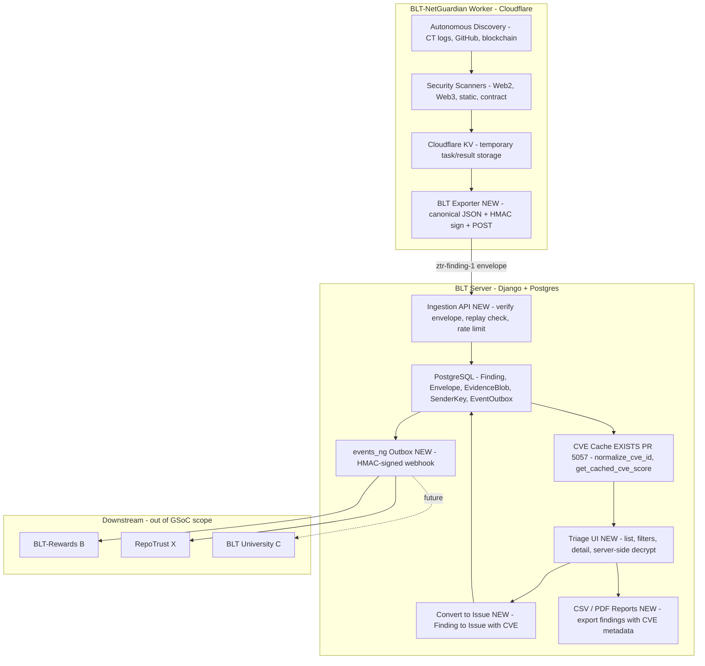

# NetGuardian — Technical approach & weekly deliverables (GSoC 2026)

> **Note for maintainers:** This is the **technical part only**. I'll add the SAT/personal sections (bio, coding skills, time commitment, etc.) once you're happy with this approach.

---

## 1. Introduction

This project extends work I have already contributed to OWASP BLT, including **PR #5057** (CVE search, filtering, caching, autocomplete, and CVE-aware indexing on the Issue model), merged in the main BLT repo. NetGuardian builds on that CVE layer and on the existing **BLT-NetGuardian Worker** (Cloudflare Python Worker for autonomous discovery and scanning) to deliver a zero-trust ingestion path for security findings, CVE-aware triage, and verified events for downstream systems (Rewards, RepoTrust, University).

### Relationship to the existing BLT-NetGuardian Worker

The [BLT-NetGuardian Worker](https://github.com/Pritz395/BLT-NetGuardian) discovers targets (CT logs, GitHub API, blockchain) and runs security scanners (Web2, Web3, static, contract). Results stage in Cloudflare KV. **This GSoC does not rewrite the Worker.** It connects that pipeline to BLT by: (1) adding a BLT exporter in the Worker that converts scan results to signed `ztr-finding-1` envelopes and POSTs to BLT; (2) building BLT ingestion (`/api/ng/ingest`) with replay protection and Postgres storage; (3) enriching findings via PR #5057 CVE cache; (4) adding a triage UI and "Convert to Issue"; (5) emitting HMAC-signed verified events for downstream. **Split:** Worker = discovery + scanning + KV; BLT = ingestion + triage + CVE + Issue creation + events.

---

## 2. Architecture overview

**Legend (downstream):** B = BLT-Rewards; X = RepoTrust; C = BLT-University.

Worker already exists; GSoC adds the Exporter and all BLT-side pieces. Flow: Worker → KV → Exporter → signed envelopes → ingestion → CVE enrichment → triage UI → "Convert to Issue" → HMAC-signed webhook. No new queue; existing throttling only.

**12-week mapping:**

| Week | Delivers |
|------|----------|
| 1 | Envelope schema + DB (Finding, Envelope, EvidenceBlob, SenderKey) + ingestion API, replay protection, auth |
| 2 | BLT Exporter in Worker + E2E Worker → BLT test |
| 3 | Triage list/detail + permissions + server-side decrypt + "Convert to Issue" sketched |
| 4 | CVE plumbing (PR #5057) + validation & dedup (fingerprint, confidence) |
| 5 | CVE-aware triage UX + evidence viewer polish start |
| 6 | Evidence viewer + RFI templates + midterm E2E demo |
| 7 | Worker → BLT fidelity suite + acceptance gates (≥95% ingestion, ≥90% CVE match) |
| 8 | Consensus/reconfirmation for criticals + quotas & resilience |
| 9 | Remediation fragments + "why this matters" in triage and reports |
| 10 | security.txt + CSV (required); PDF (optional) |
| 11 | events_ng outbox + HMAC webhook + read-only events API |
| 12 | Hardening + pilot prep + pilot run + v1.0 |

---

## 3. Stack & scope

Django 5.x + DRF + Postgres on BLT; Cloudflare Python Worker (existing) for scanning. Detection stays in the Worker; GSoC adds DRF ingestion (`/api/ng/ingest`, `/api/ng/ingest/batch`), triage UI (server-rendered, HTMX), and no new infra (no Celery, no new queues). Evidence: server-side decrypt, audited access. Reports: CSV required, PDF optional. Signatures: HMAC-SHA256 in Worker (stdlib only); Ed25519 optional later on BLT side. Security-critical code: hand-written from spec, tests required.

---

## 4. Community bonding (pre-Week 1)

Deliverables: a one-pager for `ztr-finding-1` (fields, signature, time window, nonce, key distribution); an adoption/readiness checklist (install modes, data boundaries); mentor sign-off on the v1 envelope, BLT Exporter interface, and "verified event" definition for downstream. Activities: re-review BLT and Worker code and PR #5057; draft and iterate the one-pager and checklist with mentors; map Worker `ScanResult` to envelope fields; document decisions.

---

## 5. Week-by-week plan (phases 1–16)

**GSoC 12-week calendar:**

| GSoC Week | Focus | Notes |
|----------|--------|------|
| 1 | Phases 1–2: envelope/schema + ingestion & zero-trust | As-is |
| 2 | Phase 3 only: BLT Exporter integration | Full 5-day sprint in Worker |
| 3 | Phase 4 only: Triage-lite UI | |
| 4 | Phases 5–6: CVE plumbing + validation/dedup | Phase 5 fast (reuse PR #5057) |
| 5 | Phase 7 + Phase 8 start | CVE-aware UX + polish |
| 6 | Phase 8: triage polish, RFIs, midterm E2E | Checkpoint week |
| 7 | Phase 9: Worker → BLT fidelity & acceptance gates | |
| 8 | Phase 10: consensus & resilience | |
| 9 | Phase 11: remediation & insights | |
| 10 | Phase 12: disclosure & reports (CSV required; PDF optional) | |
| 11 | Phase 13: verified events for downstream | |
| 12 | Phases 14–16: hardening + pilot prep + pilot run + v1.0 | |

### Phase 1 — Envelope & schema

**Weekly deliverables:**
- A written `ztr-finding-1` spec covering fields, signatures, timestamps, and nonces — detailed enough that someone else could implement against it without coming back with questions.
- Database/ORM models for Finding, Envelope, EvidenceBlob, and SenderKey with migrations applied and everything wired into admin.
- A key registry model (per-org/per-sender) with `kid` for rotation and a clear approach to nonce uniqueness — either a DB table or a cache-key pattern, decided and documented.
- Pagination defaults and a DB index strategy for findings written down now, so we're not improvising under pressure later.
- Serializer stubs for Finding/Envelope and unit tests covering model constraints and validation.

---

### Phase 2 — Ingestion & zero-trust

**Weekly deliverables:**
- A working ingestion API (`/api/ng/ingest`) that accepts signed findings and verifies signatures and timestamps on the server side.
- Solid replay protection: Envelope unique on `(sender_id, nonce)`, clock skew capped at ±5 min, `received_at`/`validated_at` stored, and anything expired or replayed rejected cleanly.
- TokenAuthentication with per-org scoping, body size caps (≤1 MB), and rate limits wired into the existing throttling middleware.
- Property tests for the signature window, log redaction, and idempotency — plus one E2E test proving a valid envelope actually ends up as a stored Finding.

---

### Phase 3 — BLT Exporter integration

**Weekly deliverables:**
- A BLTExporter class in BLT-NetGuardian Worker (`src/exporters/blt_exporter.py`) that maps Worker ScanResult to ztr-finding-1 envelopes, signs with HMAC-SHA256 using Cloudflare Workers stdlib (no heavy crypto libs), and POSTs to BLT `/api/ng/ingest` with retry/timeout.
- An integration point in `src/worker.py` → `handle_result_ingestion()` that calls the exporter after KV storage — best-effort, so the Worker keeps going if BLT is unreachable.
- Cloudflare secrets configured: BLT_INGEST_URL, SENDER_ID, KID, SENDER_SECRET.
- End-to-end test: Worker scan → KV → BLT exporter → BLT dev server → Finding row in Postgres.

---

### Phase 4 — Triage-lite UI

**Weekly deliverables:**
- A Finding list view with severity/rule/target filters, pagination, and sort — something you can actually sit down and use to triage.
- A detail view that decrypts evidence server-side, gates it behind explicit permissions, logs every access, and renders it in redacted form.
- A "Convert to Issue" flow sketched out and wired to the BLT Issue model (CVE columns come later).
- Org-scoped permissions enforced throughout, with basic template or browser tests for list and detail.

---

### Phase 5 — CVE intelligence

**Note:** CVE plumbing is quick (~2 days) because it reuses existing `website/cache/cve_cache.py` from PR #5057. Week 4 pairs Phase 5 with Phase 6 (validation/dedup) to keep the 12-week timeline on track.

**Weekly deliverables:**
- Findings (or linked Issues) populated with `cve_id` and `cve_score`, using `normalize_cve_id` and `get_cached_cve_score` from `website/cache/cve_cache.py` — no reinventing the wheel.
- CVE columns surfaced in both the triage list and detail views.
- Mapping tests only; cache-miss fallback is already covered by the existing suite.

---

### Phase 6 — Validation & dedup

**Weekly deliverables:**
- A fingerprint defined as `(rule_id, target_url, optional selector, evidence_digest)` with a unique DB index backing it.
- Idempotent submission that upserts by fingerprint — new evidence attaches to an existing Finding instead of creating a duplicate.
- A confidence score field (Decimal [0, 1]) and optional FP checklist fields on Finding.
- Tests covering duplicate collapse, evidence attachment rollup, and concurrent submission races.

---

### Phase 7 — CVE-aware triage UX

**Weekly deliverables:**
- Finding list filters for `cve_id`, `cve_score_min`, and `cve_score_max`, mirroring what already exists on the Issue side.
- A "Related CVEs" side panel rendered server-side from the existing CVE index — no new infrastructure.
- CVE autocomplete reused in the "Convert to Issue" flow, so people aren't typing CVE IDs by hand.
- UI tests confirming filters interact correctly and the related CVE list and autocomplete behave as expected.

---

### Phase 8 — Triage polish & RFI

**Weekly deliverables:**
- A noticeably better evidence viewer — improved layout, syntax highlighting or snippet context, something that makes reviewing findings less of a slog.
- Canned RFI templates as markdown/callout partials, ready to drop into the detail view without touching email plumbing.
- Tests confirming templates don't leak secrets and render safely.
- **Midterm checkpoint:** A full E2E demo — Worker scan → BLT Exporter → signed ingestion → Finding → triage list → server-side decrypt → "Convert to Issue" with CVE autopopulated.

---

### Phase 9 — Fidelity & acceptance gates

**Weekly deliverables:**
- 5–8 curated fixtures with known expected outcomes (e.g. specific CVE IDs with known severities) — the ground truth we'll measure the Worker → BLT pipeline against.
- A management command in BLT that queries Worker `/api/vulnerabilities` and compares results against expected fixtures, persisting per-fixture metrics (ingestion success, CVE enrichment match).
- Documented acceptance gates: ≥95% ingestion success rate; ≥90% CVE match on known CVEs.
- Scope is pipeline integrity and CVE enrichment accuracy — not scanner rule tuning, which is already the Worker's job.

---

### Phase 10 — Consensus & resilience

**Weekly deliverables:**
- A reconfirmation gate for critical-severity findings — a second heuristic or rule has to agree before "Convert to Issue" goes through.
- Confidence scoring updated to factor in whether reconfirmation happened.
- Per-org/hour quotas via DB counters, hooked into the existing throttling and IPRestrictMiddleware — batch ingestion stays in DB transactions, no new queue.
- Tests for the reconfirmation gate and for 429/Retry-After behavior under load.

---

### Phase 11 — Remediation & insights

**Weekly deliverables:**
- Markdown remediation fragments for each rule type, with OWASP links — static content, nothing dynamic.
- CVE-based enrichment when `cve_id` is present: advisory links and OWASP context so reviewers don't have to leave the page.
- "Why this matters" callouts and remediation hints surfaced in the triage detail view and report output.
- Tests confirming fragments render safely and map correctly to the right rules and CVEs.

---

### Phase 12 — Disclosure helpers & reports

**Weekly deliverables:**
- security.txt detection (fetch/parse or a stub) integrated into "Convert to Issue" and the report flow, so disclosure contacts surface automatically.
- CSV export for findings with CVE metadata included; snapshot test confirming sensitive evidence doesn't leak in plain text.
- PDF export (e.g. WeasyPrint, timeboxed to 0.5–1 week); snapshot test confirming the same redaction guarantees hold.

---

### Phase 13 — Verified events for downstream

**Weekly deliverables:**
- An EventOutbox table with a versioned payload schema: `cve_id`, `cve_score`, `rule_id`, `severity`, `org_id`/`repo`, `finding_id`/`issue_id`, `created_at`, `dedupe_key`, `version`.
- Webhook delivery signed with HMAC-SHA256 (reusing BLT's existing GitHub/Slack HMAC patterns from `website/views/user.py`), emitted on "Convert to Issue" and on resolution, with an idempotency key and exponential backoff.
- A read-only API for event retrieval with pagination and filtering, plus consumption docs written specifically for Rewards (B) and RepoTrust (X).
- Tests covering event emission, idempotency, payload shape, and webhook signature verification.

---

### Phase 14 — Hardening & security review

**Weekly deliverables:**
- A proper security review pass: key handling, nonce uniqueness, evidence redaction in logs and templates, permission checks everywhere, and cache-poisoning resistance.
- Dead code and over-generalized code cleaned out; docs updated to reflect what's actually implemented.
- A checklist or short report summarizing what was reviewed and what was fixed.

---

### Phase 15 — Pilot prep & docs

**Weekly deliverables:**
- A pilot checklist covering configuration steps, runbooks, and a rollback plan — so the first run isn't improvised.
- A migration rollback note and data deletion playbook for evidence blobs.
- User, admin, setup, and contribution docs polished and reviewed end-to-end.

---

### Phase 16 — Pilot run & final polish

**Weekly deliverables:**
- A live pilot with 1–2 orgs, with real metrics collected: time-to-triage, FP/FN feedback, and how useful the CVE filters and reports actually are in practice.
- High-priority fixes applied based on feedback, v1.0 tagged, and a short "what was delivered" summary ready for the GSoC final report.

---

## 6. Milestone checkpoints

- **Midterm (after Phase 8):** E2E demo — Worker scan → BLT Exporter → signed ingestion → Finding → triage list → server-side decrypt → "Convert to Issue" with CVE autopopulated.
- **Final (after Phase 16):** Full Worker → BLT pipeline live + verified-events webhook + fidelity metrics + pilot feedback.

---

## 7. Security invariants (ztr-finding-1)

Envelope: `version`, `sender_id`, `issued_at` (UTC), `nonce`, `signature`, `payload_digest`, `payload_ciphertext`|`plaintext_mode`, `alg`. Signature: HMAC-SHA256 over canonical JSON; ±300s skew rejected; nonces strictly monotonic per `sender_id`; `unique(sender_id, nonce)` in DB. Ed25519 optional later on BLT. Evidence: store digest and size only; max size and MIME limits; never log ciphertext/plaintext. Inputs: normalized, length-capped; logs redact secrets. Permissions: Finding reads org-scoped; evidence gated and access logged; "Convert to Issue" enforces org ownership and rate limits.

---

## 8. Tests (beyond PR #5057)

Envelope/ingestion: valid, expired, future, replayed; DB uniqueness; signature mismatch and canonicalization; size/MIME caps; access logging. Exporter: Worker → BLT E2E; retry on downtime; idempotency via nonce; malformed handling. Dedup: same fingerprint collapses; concurrent submissions. Triage: pagination; permission leakage; CVE filters and cache paths; cache-poisoning resistance. Consensus: reconfirmation gate; 429/Retry-After. Reports: CSV/PDF redaction and no plaintext secrets.

---

## 9. Cross-project integration

Signed webhook for Verified Events with stable, versioned schema; concrete consumption examples for BLT-Rewards and RepoTrust. No downstream scoring or education logic in NetGuardian. Version and dedupe_key in envelope and events; HMAC reuses BLT patterns (`website/views/user.py`) — no new signing infra.

---

## 10. Key files

**Worker (existing):** `src/worker.py`, `src/scanners/*.py`, `src/models/*.py`, `ARCHITECTURE.md`, `API.md`.  
**BLT:** `website/cache/cve_cache.py` (PR #5057), `website/models.py` (Issue.cve_id/cve_score), `blt/middleware/throttling.py` & `ip_restrict.py`, `website/views/user.py` (HMAC); **new:** `website/netguardian/` (models, views, templates).
