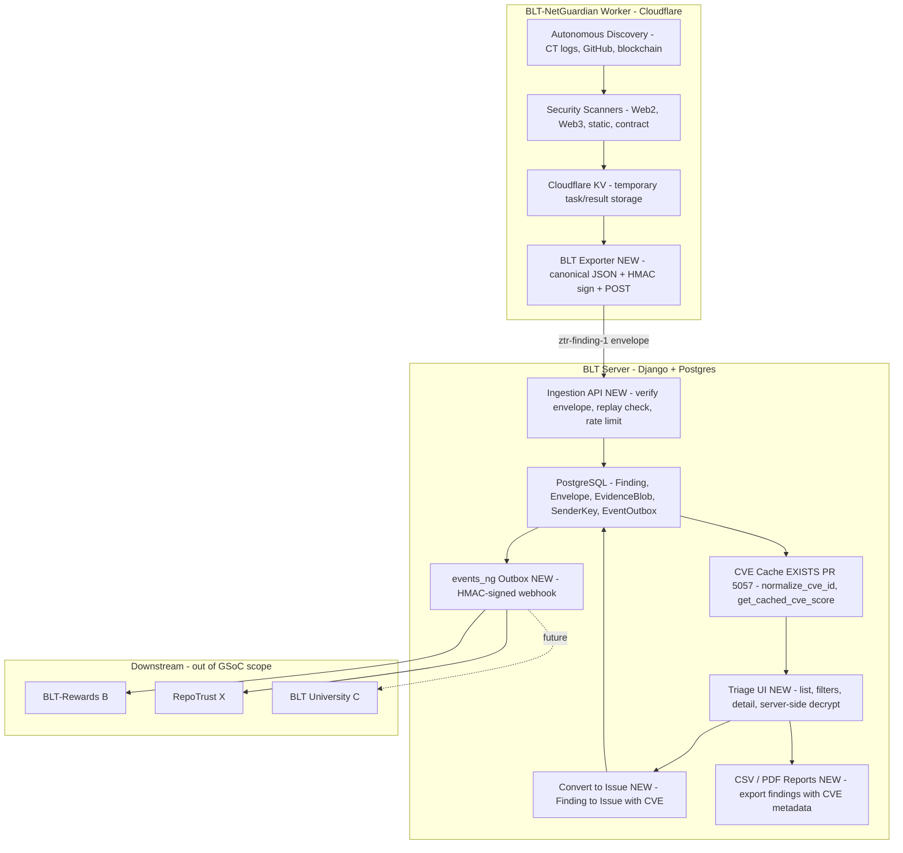

# NetGuardian — Technical approach & weekly deliverables (GSoC 2026)

> **Note for maintainers:** This is the **technical part only**. I'll add the SAT/personal sections (bio, coding skills, time commitment, etc.) once you're happy with this approach.

---

## 1. Introduction

This project extends work I have already contributed to OWASP BLT, including **PR #5057** (CVE search, filtering, caching, autocomplete, and CVE-aware indexing on the Issue model), merged in the main BLT repo. NetGuardian is not a from-scratch implementation: it builds on that CVE layer and on the existing **BLT-NetGuardian Worker** (a Cloudflare Python Worker that already performs autonomous discovery and scanning) to deliver a zero-trust encrypted ingestion path for security findings, CVE-aware triage, and verified events for downstream systems (Rewards, RepoTrust, University).

### Relationship to the existing BLT-NetGuardian Worker

The [BLT-NetGuardian Worker](https://github.com/Pritz395/BLT-NetGuardian) is an autonomous security scanning system running as a Cloudflare Python Worker. It continuously discovers targets (via Certificate Transparency logs, GitHub API, blockchain monitoring) and runs security scanners (Web2 crawler, Web3 monitor, static analyzer, smart contract auditor). Results are currently stored in Cloudflare KV for temporary staging.

**This GSoC project does not rewrite the Worker.** Instead, it connects the Worker's autonomous scanning into BLT's triage and issue-tracking infrastructure by:

1. **Adding a BLT exporter in the Worker** (`src/exporters/blt_exporter.py`) that converts Worker scan results into `ztr-finding-1` envelopes, signs them with HMAC-SHA256, and POSTs them to BLT's new ingestion API.
2. **Building the BLT server-side ingestion layer** (`/api/ng/ingest`) that verifies envelopes, enforces replay protection, and stores findings in Postgres.
3. **Integrating with PR #5057** (CVE cache) to enrich findings with CVE IDs and scores using the existing `normalize_cve_id()` and `get_cached_cve_score()` utilities.
4. **Creating a triage UI in BLT** for security teams to review findings, filter by CVE, decrypt evidence server-side, and convert findings into tracked BLT Issues.
5. **Emitting verified events** via HMAC-signed webhooks to downstream systems (BLT-Rewards, RepoTrust, BLT-University).

**Architecture split:**
- **Worker (Cloudflare):** Autonomous discovery + scanning + KV storage. No changes to core scanners.
- **BLT (Django/Postgres):** Ingestion + triage + CVE enrichment + Issue creation + verified events.

---

## 2. Architecture overview

**Legend (downstream):** B = BLT-Rewards; X = RepoTrust; C = BLT-University.

**What this diagram is:** The target architecture after the full 16-phase plan. The Worker side (Cloudflare) already exists; the GSoC work adds the BLT Exporter and builds everything on the BLT Server side.

**Data flow in short:** Worker discovers targets and runs scanners &rarr; results stage in KV &rarr; BLT Exporter converts to signed `ztr-finding-1` envelopes and POSTs to BLT &rarr; ingestion API verifies and stores &rarr; CVE layer (existing PR #5057) enriches &rarr; triage UI with server-side decrypt and "Convert to Issue" &rarr; verified events emitted via HMAC-signed webhook for downstream. No new queue; periodic management commands and existing throttling only.

**Where the 12 GSoC weeks map to this diagram:**

| Week | What it delivers in the diagram |
|------|---------------------------------|
| 1 | Envelope schema + DB (Finding, Envelope, EvidenceBlob, SenderKey) + ingestion API, replay protection, auth |
| 2 | BLT Exporter in Worker (`src/exporters/blt_exporter.py`) + E2E Worker &rarr; BLT ingestion test |
| 3 | Triage list/detail UI + permissions + server-side decrypt + "Convert to Issue" sketched |
| 4 | CVE plumbing (cve_id, cve_score via PR #5057) + validation & dedup (fingerprint, confidence) |
| 5 | CVE-aware triage UX (filters, Related CVEs, autocomplete) + evidence viewer polish start |
| 6 | Evidence viewer polish + RFI templates + midterm E2E demo (full path through triage and Convert to Issue) |
| 7 | Worker &rarr; BLT fidelity suite + metrics and acceptance gates (ingestion success rate, CVE enrichment accuracy) |
| 8 | Consensus/reconfirmation for criticals + quotas and resilience in the ingestion path |
| 9 | Remediation fragments and "why this matters" surfaced in triage and reports |
| 10 | security.txt integration + CSV export (required); PDF export (optional/stretch) |
| 11 | events_ng outbox + HMAC-signed webhook + read-only events API for downstream systems |
| 12 | Security hardening + pilot prep + pilot run + v1.0 and final report |

---

## 3. Stack & scope (CodeRabbit-aligned)

- **Stack:** Django 5.x + Django Rest Framework + PostgreSQL on the BLT server side; Cloudflare Python Worker (existing) for autonomous scanning.
- **Architecture:**
  - **Detection/scanning:** Already implemented in BLT-NetGuardian Worker (Cloudflare); no new detector code in GSoC scope.
  - **Ingestion API:** New lightweight DRF endpoints in BLT (`/api/ng/ingest`, `/api/ng/ingest/batch`) reusing existing auth patterns (`TokenAuthentication`, org-scoped permissions).
  - **Triage UI:** Server-rendered templates with HTMX (reuses BLT frontend patterns from `website/templates/`).
  - **No new infrastructure:** No Celery, no separate worker daemons, no new queue systems. Periodic management commands (cron/k8s CronJob) where needed; existing throttling middleware for rate limits.
- **Evidence:** Server-side decrypt with audited access (permission checks + access logging). Client-side crypto is post-v1.
- **Reports:** CSV required; PDF optional/stretch (e.g. via WeasyPrint, timeboxed in Phase 12).
- **Signatures:** HMAC-SHA256 only in the Worker (Cloudflare stdlib compatible); Ed25519 is a future option for BLT-side verification but not required in Worker.
- **Security-critical code:** Hand-written from a written spec and covered by tests; LLMs only for scaffolding and docs.

---

## 4. Community bonding (pre-Week 1)

**Weekly deliverables:**
- A one-pager for `ztr-finding-1` that nails down the fields, signature algorithm, time window, nonce semantics, and how keys get distributed.
- An adoption/readiness checklist covering the target install modes and where data boundaries sit.
- Mentor sign-off on the v1 envelope, the BLT Exporter interface, and a clear "verified event" definition that downstream consumers can actually build against.

**Day 1-2:** Re-review BLT codebase, BLT-NetGuardian Worker (`src/worker.py`, `src/scanners/`, `ARCHITECTURE.md`), and PR #5057 CVE paths; sync with other GSoC project owners (Preflight, Rewards, University, MCP) on shared interfaces and timeline touchpoints.  
**Day 3-4:** Draft and iterate `ztr-finding-1` one-pager with mentors; draft adoption checklist (install modes, data boundaries, retention); map Worker `ScanResult` fields to envelope fields.  
**Day 5:** Finalize both deliverables; confirm env, fixtures, and AI-tool rules; document decisions in a short design note.

---

## 5. Week-by-week plan (granular deliverables + day-level)

**GSoC 12-week calendar (how the detailed phases map to coding weeks):**

| GSoC Week | Focus (from detailed plan) | Notes |
|----------|-----------------------------|-------|
| 1 | Phases 1-2: envelope/schema + ingestion & zero-trust plumbing | As-is |
| 2 | Phase 3 only: BLT Exporter integration | Split; full 5-day sprint in Worker |
| 3 | Phase 4 only: Triage-lite UI | Split; list/detail + permissions + Convert to Issue |
| 4 | Phases 5-6: CVE plumbing + validation/dedup | Phase 5 is fast (reuse PR #5057); pairs with Phase 6 |
| 5 | Phase 7: CVE-aware triage UX + Phase 8 start (polish) | Good pairing |
| 6 | Phase 8: triage polish, RFIs, midterm E2E demo | Checkpoint week |
| 7 | Phase 9: Worker &rarr; BLT fidelity & acceptance gates | |
| 8 | Phase 10: consensus & resilience | |
| 9 | Phase 11: remediation & insights | |
| 10 | Phase 12: disclosure helpers & reports (CSV required; PDF optional) | |
| 11 | Phase 13: verified events for downstream | |
| 12 | Phases 14-16: hardening + pilot prep + pilot run + v1.0 | Sequential: harden &rarr; pilot &rarr; final report |

### Phase 1 - Envelope & schema

**Weekly deliverables:**
- A written `ztr-finding-1` spec that covers fields, signatures, timestamps, and nonce - enough that someone else could implement against it.
- Database/ORM models for `Finding`, `Envelope`, `EvidenceBlob`, and `SenderKey` with migrations applied and everything registered in admin.
- A key registry model (per-org/per-sender) with `kid` for rotation and a defined pattern for nonce uniqueness - either a DB table or a cache-key approach.
- Documented pagination defaults and a DB index strategy for findings, so we're not making it up later.
- Serializer stubs for `Finding`/`Envelope` and unit tests covering model constraints and validation.

**Day 1-2:** Finalize and document `ztr-finding-1` envelope format. Implement `Finding`, `Envelope`, `EvidenceBlob`, `SenderKey` models (encrypted bytes, digest, media_type, size); add key registry with `kid`/`alg`/rotation support; write migrations.  
**Day 3-4:** Apply migrations; register models in admin. Define pagination defaults and DB index strategy for findings. Add serializer stubs for Finding and Envelope.  
**Day 5:** Unit tests for model constraints, validation, and uniqueness; review and fix; document schema in proposal/ADR.

---

### Phase 2 - Ingestion & Zero-Trust plumbing

**Weekly deliverables:**
- A working ingestion API (`/api/ng/ingest`) that accepts signed findings and verifies signatures and timestamps server-side.
- Solid replay protection: `Envelope` unique on `(sender_id, nonce)`, clock skew capped at &plusmn;5 min, `received_at`/`validated_at` stored, and anything expired or replayed gets rejected cleanly.
- `TokenAuthentication` with per-org scoping, body size caps (&le;1 MB), and rate limits wired into the existing throttling middleware.
- Property tests for the signature window, log redaction, and idempotency - plus one E2E test that proves a valid envelope actually ends up as a stored Finding.

**Day 1-2:** Implement `NGIngestView` and request parsing. Add server-side signature and timestamp verification (human-written from spec). Implement DB-backed nonce/replay: unique (sender_id, nonce), clock skew check, store received_at/validated_at.  
**Day 3-4:** Wire TokenAuthentication and per-org scoping; add body size caps; plug into existing throttling middleware. Add audit log stubs for accept/reject.  
**Day 5:** Property tests (valid/expired/future/replayed envelope, signature mismatch, canonicalization); log redaction and idempotency tests; E2E test: signed envelope &rarr; stored Finding.

---

### Phase 3 - BLT Exporter Integration

**Weekly deliverables:**
- A `BLTExporter` class in BLT-NetGuardian Worker (`src/exporters/blt_exporter.py`) that converts Worker `ScanResult` into `ztr-finding-1` envelopes, signs with HMAC-SHA256 using Cloudflare Workers stdlib (no heavy crypto libs), and POSTs to BLT `/api/ng/ingest` with retry/timeout.
- Integration point in `src/worker.py` &rarr; `handle_result_ingestion()` that calls the exporter after KV storage (best-effort; Worker continues if BLT is unreachable).
- Cloudflare secrets configured: `BLT_INGEST_URL`, `SENDER_ID`, `KID`, `SENDER_SECRET`.
- End-to-end test: Worker scan &rarr; KV &rarr; BLT exporter &rarr; BLT dev server &rarr; Finding row in Postgres.

**Day 1-2:** Implement `BLTExporter.build_envelope()` (map Worker result &rarr; ztr-finding-1 fields). Implement canonical JSON serialization and HMAC signing (stdlib only).  
**Day 3-4:** Implement `BLTExporter.post_to_blt()` with retry (3 attempts, exponential backoff). Wire into `worker.py` after KV storage.  
**Day 5:** E2E test: trigger scan in Worker &rarr; verify Finding appears in BLT local dev; document secrets setup for deployment.

---

### Phase 4 - Triage-lite UI

**Weekly deliverables:**
- A Finding list view with severity/rule/target filters, pagination, and sort - something you can actually use to triage.
- A detail view that decrypts evidence server-side, gates it behind explicit permissions, logs every access, and renders it in redacted form.
- A "Convert to Issue" flow sketched out and wired to the BLT Issue model (CVE columns come later).
- Org-scoped permissions enforced throughout, with basic template or browser tests for list and detail.

**Day 1-2:** Implement Finding list view (DRF or template): filters severity/rule/target, pagination, sort. Implement org-scoped permission checks; ensure only org members see org findings.  
**Day 3-4:** Implement detail view; server-side decrypt with permission check and access logging; render redacted evidence. Sketch "Convert to Issue" (button + view wiring to Issue model).  
**Day 5:** Basic template or browser tests for list/detail and filters; permission leakage test (Org A user cannot see Org B findings); document UX for midterm demo.

---

### Phase 5 - CVE Intelligence plumbing

**Note:** CVE plumbing is fast (~2 days) because it reuses existing `website/cache/cve_cache.py` from PR #5057. Week 4 pairs Phase 5 with Phase 6 (validation/dedup) to keep the 12-week timeline.

**Weekly deliverables:**
- Findings (or linked Issues) populated with `cve_id` and `cve_score`, using `normalize_cve_id` and `get_cached_cve_score` from `website/cache/cve_cache.py` - no reinventing the wheel.
- CVE columns surfaced in both the triage list and detail views.
- Mapping tests only; cache-miss fallback is already covered by the existing suite.

**Day 1-2:** Add nullable `cve_id`/`cve_score` on Finding (or link path to Issue). Implement mapping layer: rule &rarr; CVE lookup; call `normalize_cve_id` and `get_cached_cve_score`; populate on ingest or on demand.  
**Day 3-4:** Add CVE columns to list and detail templates/API; ensure existing CVE cache and indexes are used.  
**Day 5:** Unit tests for CVE mapping and cache-miss fallback; no new NVD/cache logic - reuse PR #5057 paths only.

---

### Phase 6 - Validation & dedup

**Weekly deliverables:**
- A fingerprint defined as `(rule_id, target_url, optional selector, evidence_digest)` with a unique DB index backing it.
- Idempotent submission that upserts by fingerprint - new evidence attaches to an existing Finding rather than creating a duplicate.
- A confidence score field (Decimal [0, 1]) and optional FP checklist fields on Finding.
- Tests that cover duplicate collapse, evidence attachment rollup, and concurrent submission races.

**Day 1-2:** Implement fingerprint computation and unique index on (rule_id, target_url, selector, evidence_digest). Implement upsert logic: same fingerprint updates/attaches evidence; new fingerprint creates new Finding.  
**Day 3-4:** Add confidence score (Decimal, bounded) and FP checklist fields; migration; wire into ingestion and triage.  
**Day 5:** Tests: same fingerprint collapses; evidence variation creates new attachment; concurrent posts collapse correctly; document dedup semantics.

---

### Phase 7 - CVE-aware triage UX

**Weekly deliverables:**
- Finding list filters for `cve_id`, `cve_score_min`, and `cve_score_max`, mirroring what already exists on the Issue side.
- A "Related CVEs" side panel rendered server-side from the existing CVE index - no new infrastructure.
- CVE autocomplete reused in the "Convert to Issue" flow, so people aren't typing CVE IDs by hand.
- UI tests confirming filters interact correctly and the related CVE list and autocomplete behave as expected.

**Day 1-2:** Add filter backend/query params for Finding list: cve_id, cve_score_min, cve_score_max (reuse patterns from Issue). Expose in API and wire to list template.  
**Day 3-4:** Implement "Related CVEs" side panel (server-rendered, existing CVE index). Integrate CVE autocomplete into "Convert to Issue" form.  
**Day 5:** UI/tests for filter combinations and related CVE panel; verify no permission leakage; update triage docs.

---

### Phase 8 - Triage polish & RFI

**Weekly deliverables:**
- A noticeably better evidence viewer - improved layout, syntax highlighting or snippet context, something that makes reviewing findings less painful.
- Canned RFI templates as markdown/callout partials, ready to drop into the detail view without touching any email plumbing.
- Tests confirming templates don't leak secrets and render safely.
- **Midterm checkpoint:** A full E2E demo - Worker scan &rarr; BLT Exporter &rarr; signed ingestion &rarr; Finding &rarr; triage list &rarr; server-side decrypt &rarr; "Convert to Issue" with CVE autopopulated.

**Day 1-2:** Improve evidence viewer (layout, syntax highlighting or snippet context). Add markdown/callout partial for "Request more info" and 2-3 canned RFI templates (stored safely, no secrets).  
**Day 3-4:** Wire RFI templates into detail view; ensure all rendering is safe (escape, no raw HTML from findings).  
**Day 5:** Tests for template safety and non-leakage; run full E2E for midterm: Worker &rarr; Exporter &rarr; signed envelope &rarr; Finding &rarr; triage list with filters &rarr; decrypt/view evidence &rarr; "Convert to Issue" with CVE autopopulated; record demo.

---

### Phase 9 - Fidelity & acceptance gates

**Weekly deliverables:**
- 5-8 curated fixtures with known expected outcomes (e.g., specific CVE IDs with known severities) - the ground truth we'll measure Worker &rarr; BLT pipeline integrity against.
- A management command in BLT that queries Worker `/api/vulnerabilities` and compares against expected fixtures, persisting per-fixture metrics (ingestion success, CVE enrichment match).
- Documented acceptance gates: &ge;95% ingestion success rate; &ge;90% CVE match on known CVEs.
- Focus: measuring Worker &rarr; BLT pipeline integrity and CVE enrichment accuracy, not tuning scanner rules (the Worker already has those).

**Day 1-2:** Finalize 5-8 curated fixtures and expected results. Implement metrics persistence (ingestion success %, CVE enrichment accuracy).  
**Day 3-4:** Management command: run fixtures through pipeline, compute and store metrics; add threshold check against acceptance gates.  
**Day 5:** Wire regression test (run suite, assert gates); document fidelity metrics and gates for reviewers.

---

### Phase 10 - Consensus & resilience

**Weekly deliverables:**
- A reconfirmation gate for critical-severity findings - a second heuristic or rule has to agree before "Convert to Issue" goes through.
- Confidence scoring updated to factor in whether reconfirmation happened.
- Per-org/hour quotas via DB counters, hooked into the existing throttling and `IPRestrictMiddleware` - batch ingestion stays in DB transactions, no new queue.
- Tests for the reconfirmation gate and for 429/`Retry-After` behavior under load.

**Day 1-2:** Implement reconfirmation gate for critical findings (e.g. second rule or heuristic must agree). Update confidence scoring to reflect reconfirmation.  
**Day 3-4:** Add per-org/hour quota (DB counter); integrate with existing throttling and IPRestrictMiddleware. Ensure batch ingestion uses DB transactions only; document "no new queue" decision.  
**Day 5:** Tests: reconfirmation enforced; rate limit and 429/Retry-After under load; document resilience behavior.

---

### Phase 11 - Remediation & insights

**Weekly deliverables:**
- Markdown remediation fragments for each rule type, with OWASP links - static content, nothing dynamic.
- CVE-based enrichment when `cve_id` is present: links to advisories and OWASP so reviewers have context without leaving the page.
- "Why this matters" callouts and remediation hints surfaced in the triage detail view and report output.
- Tests confirming fragments render safely and map correctly to the right rules and CVEs.

**Day 1-2:** Author markdown remediation fragments for each rule type; add OWASP links. Add optional CVE-based enrichment (advisory links) when cve_id present.  
**Day 3-4:** Surface "why this matters" and remediation in triage detail view and in report payload; ensure safe rendering (no raw user input in fragments).  
**Day 5:** Tests for fragment rendering and rule/CVE mapping; review with mentor for tone and completeness.

---

### Phase 12 - Disclosure helpers & reports

**Weekly deliverables:**
- `security.txt` detection (fetch/parse or a stub) integrated into "Convert to Issue" and the report flow, so disclosure contacts are surfaced automatically.
- CSV export for findings with CVE metadata included; snapshot test confirming sensitive evidence doesn't leak in plain text.
- PDF export (e.g. WeasyPrint, timeboxed to 0.5-1 week); snapshot test confirming the same redaction guarantees hold.

**Day 1-2:** Implement security.txt detection (URL discovery, fetch, parse or minimal stub); add hints to "Convert to Issue" and report context. Implement CSV export (findings + CVE columns); ensure no sensitive evidence in plain text.  
**Day 3-4:** Snapshot tests for CSV (columns, redaction). Implement PDF export (WeasyPrint or chosen lib, simple template); snapshot test for PDF redaction and no plaintext secrets.  
**Day 5:** Document report formats and redaction policy; finalize both CSV and PDF as deliverables.

---

### Phase 13 - Verified events for downstream

**Weekly deliverables:**
- An `EventOutbox` table with a versioned payload schema: `cve_id`, `cve_score`, `rule_id`, `severity`, `org_id`/`repo`, `finding_id`/`issue_id`, `created_at`, `dedupe_key`, `version`.
- Webhook delivery signed with HMAC-SHA256 (reusing BLT's existing GitHub/Slack HMAC patterns from `website/views/user.py`), emitted on "Convert to Issue" and on resolution, with an idempotency key and exponential backoff.
- A read-only API for event retrieval with pagination and filtering, plus consumption docs written specifically for Rewards (B) and RepoTrust (X).
- Tests covering event emission, idempotency, payload shape, and webhook signature verification.

**Day 1-2:** Design and create `EventOutbox` model; define payload schema and version. Implement emission on "Convert to Issue" and on issue resolution; dedupe_key and idempotency.  
**Day 3-4:** Implement webhook delivery with HMAC-SHA256 (reuse existing HMAC helpers); retry with exponential backoff. Add read-only API for events (pagination, filters).  
**Day 5:** Tests for emission, idempotency, and payload; document consumption for B and X; no downstream logic in NetGuardian.

---

### Phase 14 - Hardening & security review

**Weekly deliverables:**
- A proper security review pass: key handling, nonce uniqueness, evidence redaction in logs and templates, permission checks everywhere, and cache-poisoning resistance.
- Dead code and over-generalized AI-generated code cleaned out; docs updated to match what's actually implemented.
- A checklist or short report summarizing what was reviewed and what was fixed.

**Day 1-2:** Review key storage and usage; nonce uniqueness and replay logic; evidence and PII redaction in logs and templates; permission checks on all Finding/evidence access.  
**Day 3-4:** Review cache usage for poisoning; fix any issues. Remove dead or overly generic code; align docs and comments with current behavior.  
**Day 5:** Document review findings and mitigations; run full test suite; prepare for pilot.

---

### Phase 15 - Pilot prep & docs

**Weekly deliverables:**
- A pilot checklist covering configuration steps, runbooks, and a rollback plan - so the first run isn't improvised.
- A migration rollback note and data deletion playbook for evidence blobs.
- User, admin, setup, and contribution docs polished and reviewed end-to-end.

**Day 1-2:** Write pilot checklist (config, first run, validation). Document migration rollback steps and data deletion playbook for evidence blobs.  
**Day 3-4:** Polish user-facing and admin docs; setup and contribution guide; link to ztr-finding-1 and adoption checklist.  
**Day 5:** Review with mentor; fix gaps; confirm pilot orgs and timeline for Phase 16.

---

### Phase 16 - Pilot run & final polish

**Weekly deliverables:**
- A live pilot with 1-2 orgs, with real metrics collected: time-to-triage, FP/FN feedback, and how useful the CVE filters and reports actually are in practice.
- High-priority fixes applied based on feedback, v1.0 tagged, and a short "what was delivered" summary ready for the GSoC final report.

**Day 1-2:** Execute pilot with first org; collect feedback and metrics (time-to-triage, FP/FN, CVE filter usefulness); take notes.  
**Day 3-4:** Second pilot org if applicable; apply high-priority fixes from feedback; regression test and smoke checks.  
**Day 5:** Tag v1.0; write "what was delivered" summary (features, tests, docs, pilot results); submit final report.

---

## 6. Milestone checkpoints

- **Midterm (after Phase 8):** E2E demo - Worker scan &rarr; BLT Exporter &rarr; signed ingestion &rarr; Finding in DB &rarr; triage list with filters &rarr; server-side decrypt/view evidence &rarr; "Convert to Issue" with CVE autopopulated.
- **Final (after Phase 16):** Full Worker &rarr; BLT pipeline live + verified-events webhook + curated fidelity metrics + pilot feedback.

---

## 7. Security invariants & design constraints (ztr-finding-1)

- **Required envelope fields:** `version`, `sender_id`, `issued_at` (UTC), `nonce`, `signature`, `payload_digest`, `payload_ciphertext`|`plaintext_mode`, `alg`.
- **Signature:** HMAC-SHA256 over canonical JSON (Cloudflare Workers stdlib compatible); anything outside &plusmn;300s skew gets rejected; nonces must be strictly monotonic per `sender_id` within TTL; `unique(sender_id, nonce)` enforced in DB. Ed25519 is a future option for BLT-side verification but not required in Worker.
- **Evidence:** Store only the digest and size; enforce max size and allowed MIME types; never log ciphertext or plaintext under any circumstance.
- **Inputs:** Normalized and length-capped; logs redact secrets and long fields.
- **Permissions:** All Finding reads are org-scoped; evidence is gated by explicit permission with every access logged. "Convert to Issue" enforces org ownership and rate limits.

---

## 8. Tests to include (beyond PR #5057)

- **Envelope/ingestion:** Valid, expired, future-issued, and replayed envelopes; multi-process replay via DB uniqueness; signature mismatch and canonicalization drift; size/MIME caps; filename/path sanitization; access logging on evidence reads.
- **Exporter integration:** Worker &rarr; BLT exporter &rarr; ingestion E2E; retry on BLT downtime; idempotency via nonce; malformed result handling.
- **Dedup/idempotency:** Same fingerprint collapses; evidence variation creates a new attachment; concurrent submissions collapse correctly.
- **Triage/filters:** Pagination boundaries; permission leakage (Org A user cannot see Org B findings); CVE filters reuse `normalize_cve_id` and cache paths; cache-poisoning resistance.
- **Consensus/resilience:** Critical reconfirmation gate; throttle limits under load; back-pressure returns 429 with `Retry-After`.
- **Reports:** CSV/PDF snapshot tests for redaction and no plaintext secrets.

---

## 9. Cross-project integration (future-friendly, not over-coupled)

- Expose a signed webhook for Verified Events with a stable, versioned schema; write concrete consumption examples for BLT-Rewards and RepoTrust so they're not guessing.
- Don't implement downstream scoring, gamification, or education logic - NetGuardian emits clean events and stops there.
- **Versioning:** `version` field in both the envelope (`ztr-finding-1`) and event payloads; `dedupe_key` for idempotent consumption. HMAC signing on webhooks reuses existing BLT patterns (cf. `website/views/user.py` GitHub webhook HMAC) - no new signing infrastructure.

---

## 10. Key files referenced

**BLT-NetGuardian Worker (existing):**
- `src/worker.py` - Main API handler, discovery endpoints
- `src/scanners/*.py` - Web2, Web3, static, contract scanners (exist)
- `src/models/*.py` - Task, Target, Result models in KV (exist)
- `ARCHITECTURE.md` - Current Worker architecture (KV, scanners, API)
- `API.md` - Current endpoints (`/api/tasks/queue`, `/api/results/ingest`)

**BLT Main (existing + to be added):**
- `website/cache/cve_cache.py` (PR #5057) - `normalize_cve_id()`, `get_cached_cve_score()` &check;
- `website/models.py` - `Issue.cve_id`, `Issue.cve_score` &check;
- `blt/middleware/throttling.py`, `blt/middleware/ip_restrict.py` &check;
- `website/views/user.py` - GitHub webhook HMAC pattern &check;
- `website/netguardian/` (NEW) - All NetGuardian models/views/templates &starf;
