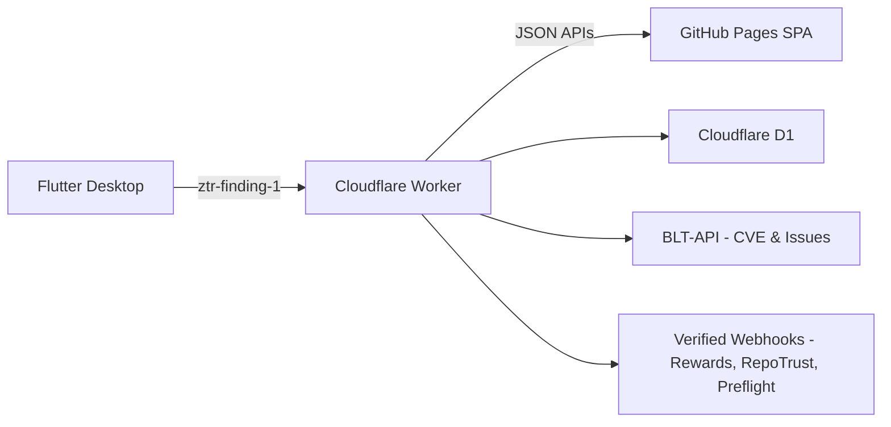
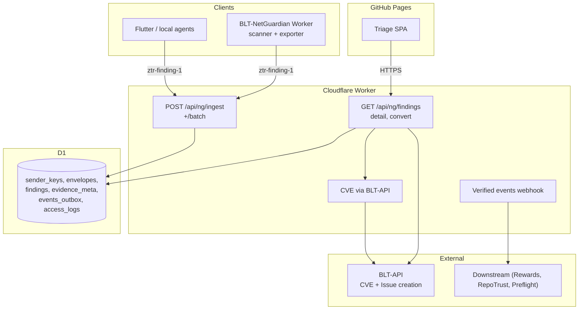

# NetGuardian — GSoC 2026 Proposal

---

## Abstract

NetGuardian connects the existing BLT-NetGuardian autonomous Worker to BLT's triage and issue-tracking through a zero-trust ingestion path, CVE-aware triage, and verified downstream events. It builds directly on PR #5057 (CVE search, filtering, caching, autocomplete, and Issue model CVE columns) by enriching new security Findings with CVE metadata so triaging is faster. The entire implementation is serverless: Cloudflare Worker + D1 + GitHub Pages SPA, with CVE normalization and Issue creation delegated to BLT-API. No new Django endpoints or PostgreSQL models in BLT main repo.

---

## Project Scope & Non-Goals

All NetGuardian backend logic runs in Cloudflare Workers with D1. The triage UI is a static SPA on GitHub Pages consuming Worker JSON APIs. CVE data and Issue creation are delegated to BLT-API.

**Non-goals:** no Django/DRF endpoints or templates in BLT main repo, no PostgreSQL migrations, no heavy PDF pipeline by default (CSV required; PDF optional and timeboxed), evidence never touches logs in readable form. Minimal, well-scoped changes to the BLT main repo are fine if integration requires them (e.g. a small permission hook or signal, narrow model tweaks, non-breaking API/webhook hooks) but any change needs to be narrowly scoped, approved by maintainers, documented, and covered by tests.

---

## What This Enables

- Zero-trust ingestion for security findings with replay resistance and strict freshness
- CVE-aware triage at scale with server-side decrypt and audited access
- Verified, signed events for downstream programs (BLT-Rewards, RepoTrust, Preflight)
- A first-class Flutter desktop app for local runs with envelope signing, offline queue, and retry
- Fully serverless footprint: GitHub Pages SPA + Cloudflare Worker + D1; no new Django/DRF endpoints or PostgreSQL migrations in BLT to ship v1; only minimal, non-breaking hooks if explicitly approved



---

## Architecture & Stack

The whole thing is serverless. The Worker (Python) handles all backend logic, D1 (SQLite) is the storage layer, and the triage UI is a static SPA on GitHub Pages. BLT-API handles CVE lookups and Issue creation. No Django, no PostgreSQL, no Celery. CORS is locked to GitHub Pages origins only; only GitHub Pages origin(s) are permitted for SPA to Worker requests.



The Worker does the heavy lifting: ingestion (`POST /api/ng/ingest` + `/batch`), triage list/detail APIs, server-side decrypt with audit logging, CVE enrichment, org-scoped auth via GitHub OAuth + PKCE, and outbox/webhooks. `X-BLT-Timestamp` is advisory for logs and rate-limiting only; `issued_at` inside the signed envelope governs expiry.

The SPA is just UI: list, filter, detail, CSV export, and the Convert to Issue button. No secrets, no decryption, no direct DB calls on the client. BLT-API handles CVE normalization/score, Issue creation, and optionally org/user membership checks.

The Flutter desktop app (Windows/macOS/Linux) is a first-class deliverable: builds/sends signed `ztr-finding-1` envelopes (HMAC-SHA256) to `/api/ng/ingest`, offline queue + retry on flaky networks, minimal UI (target selection, preview, send, links back to triage SPA). Ships as part of v1, not optional.

**Endpoints:** `/api/ng/ingest`, `/api/ng/ingest/batch`, `/api/ng/findings`, `/api/ng/findings/{id}`, `/api/ng/findings/{id}/convert`, `/api/ng/events`.

Ingestion returns `201` for created/merged, `200` for duplicates, `400` for bad_sig/clock_skew/digest_mismatch/invalid_envelope, `413` for oversized payloads, and `429` with Retry-After for rate limiting. `POST /api/ng/ingest/batch` returns `200` with an array of per-item statuses `[{index, status, ...}]`; clients retry only `status="error"` items.

Full request/response contracts, webhook headers, and D1 schema are in the Appendix.

---

## Security Invariants (ztr-finding-1)

Every envelope needs these fields: `version` ("ztr-finding-1"), `sender_id`, `kid` (for key rotation), `alg` (MUST be `hmac-sha256` for v1, Ed25519 may come later), `issued_at` (RFC 3339 UTC), `nonce` (unique per `sender_id`), `payload_digest` (`hex(SHA-256(payload_bytes))`), `signature` (base64), and exactly one of `payload_ciphertext` (base64) or `payload_plaintext` (JSON with `plaintext_mode=true`). `payload_digest` has to be computed over the exact bytes sent, not a reformatted version.

Signing: canonical JSON with the `signature` field removed, keys sorted, no extra whitespace, UTF-8 encoded, then HMAC-SHA256 over those bytes compared with `hmac.compare_digest`. `X-BLT-Timestamp` is never trusted for security decisions, only `issued_at` inside the signed envelope is.

Replay/freshness: server enforces ±5 min window on `issued_at`. `UNIQUE(sender_id, nonce)` in D1 means duplicates get a `200 {status: "duplicate"}` back, not an error.

Evidence is AES-GCM encrypted at rest with a rotatable Worker-managed key stored in Cloudflare environment secrets. Each ciphertext stores a key version; rotation happens via re-encrypt-on-access or a background migration. The SPA only ever sees digests, sizes, or pointers. Every decrypt goes to `access_logs`. Nothing sensitive appears in logs. The 1 MiB (1,048,576 bytes) cap applies to the entire HTTP request body as received over the wire; enforced with `413`, configurable per org.

All Finding queries are org-scoped. Convert-to-Issue checks org ownership first. Rate limits are per org. Nonce just needs to be unique per `sender_id`; recommended format is `"<unix_ts>-<random>"` (ordering not required; uniqueness is).

---

## 12-Week Implementation Plan

| Week | Focus |
|---|---|
| 1 | Spec + D1 schema + scaffolding |
| 2 | Ingestion verification, replay, caps |
| 3 | Auth + org scoping + /findings list |
| 4 | /findings/{id} + server-side decrypt + audit + permissions |
| 5 | CVE plumbing (BLT-API) + dedup/idempotency + CSV scaffold |
| 6 | Triage polish + RFIs + midterm E2E + blog post |
| 7 | Fidelity fixtures and acceptance gates |
| 8 | Consensus for criticals + quotas/back-pressure |
| 9 | Remediation and insights (static) |
| 10 | Disclosure helpers and reports |
| 11 | Verified events and minimal events API |
| 12 | Hardening, docs, pilot, v1.0 |

---

### Week 1 - Spec + D1 Schema + Scaffolding

Finalize the `ztr-finding-1` spec (fields, canonicalization, caps, errors). Create the D1 schema with all six tables and unique indexes. Set up the Worker project and CI skeleton. Write and test the canonicalization and digest utilities.

**Exit criterion:** Spec doc and D1 migrations committed, Worker repo with CI green, canonicalization and digest tests passing.

---

### Week 2 - Ingestion Verification, Replay, Caps

Implement `POST /api/ng/ingest` and `/batch`: signature verify, ±5 min skew enforcement, 1 MiB (1,048,576 bytes) cap on entire HTTP request body, DB uniqueness on `(sender_id, nonce)` with idempotent duplicate path, consistent error codes and JSON responses. Write property tests covering the main failure paths.

**Exit criterion:** `POST /api/ng/ingest` (+/batch) working with tests and docs, D1 constraints verified.

---

### Week 3 - Auth + Org Scoping + /findings List

- GitHub OAuth + PKCE in Worker; secure session cookie
- Org scoping and permission checks on list queries
- `/api/ng/findings` with filters/paging/sort; SPA list view (no detail yet)

**Exit criterion:** Login working, org-scoped list functional, permission boundaries tested.

---

### Week 4 - /findings/{id} + Server-side Decrypt + Audit + Permissions

- `/api/ng/findings/{id}` returns redacted metadata + server-side decrypted snippet
- Audit logging on every evidence view; enforce org membership and permission checks
- SPA detail view: redacted snippet, access audit indicator, "Convert to Issue" (stub)

**Exit criterion:** Detail and decrypt path working, audit log on every evidence view, org-scoped access enforced.

---

### Week 5 - CVE Plumbing (BLT-API) + Dedup/Idempotency + CSV Scaffold

- Integrate BLT-API `normalize_cve_id`/`get_cve_score`; store `cve_id`/`cve_score` on Finding; SPA CVE filters
- Enforce fingerprint uniqueness `(rule_id, target_url, selector?, evidence_digest)` with upsert semantics; concurrency tests
- CSV export endpoint with redaction; SPA "Export CSV" button; snapshot tests

**Exit criterion:** CVE enrichment and filters functional, dedup proven under concurrency, CSV export with redaction tests passing.

---

### Week 6 - Triage Polish + RFIs + Midterm E2E + Blog Post

Evidence viewer polish; canned RFI fragments; midterm E2E: login, ingest, triage, decrypt, Convert-to-Issue (BLT-API), verified event, CSV. Public technical blog post covering architecture, security invariants, integration approach, and lessons learned.

**Exit criterion:** E2E demo runs clean, midterm blog post published, midterm checkpoint passed.

---

### Week 7 - Fidelity Fixtures and Acceptance Gates

Build 5-8 curated fixtures with known expected outcomes (CVE IDs + severities). Persist ingestion and CVE enrichment metrics in D1. Enforce acceptance thresholds in CI (>=95% ingestion success, >=90% CVE match). Document the fixture procedure and regression checklist.

**Exit criterion:** Metrics pipeline live, thresholds enforced in CI.

---

### Week 8 - Consensus for Criticals + Quotas/Back-pressure

Consensus gate for criticals: auto-convert only if two or more signals corroborate, otherwise manual override. Update confidence scoring. Per-org/hour quotas and 429 with Retry-After. SPA handles back-pressure gracefully.

**Exit criterion:** Consensus gate on, quotas and 429 behavior solid, tests passing.

---

### Week 9 - Remediation and Insights (Static)

Map remediation fragments to `rule_id`s with OWASP links. Add "why this matters" callouts. Render safe static content in the SPA. Test rule-to-fragment mapping and confirm no XSS vectors.

**Exit criterion:** Remediation content live, safe rendering confirmed.

---

### Week 10 - Disclosure Helpers and Reports

Integrate `security.txt` detection into Convert-to-Issue and reports. Finalize CSV. PDF is optional and timeboxed to 0.5-1 week with the same redaction rules; deferred if it proves unstable.

**Exit criterion:** CSV and `security.txt` live, PDF only if timebox succeeds, tests green.

---

### Week 11 - Verified Events and Minimal Events API

Insert into `events_outbox` on convert/resolution with `version`, `dedupe_key`, and HMAC signature. Webhook delivery with HMAC headers, exponential backoff retries, and `dedupe_key` idempotency. Read-only `/api/ng/events` for consumers. Test signature verification, retry logic, idempotent delivery. Write example consumers and docs for BLT-Rewards, RepoTrust, and Preflight.

**Exit criterion:** Webhooks working with retries, events API documented and tested.

---

### Week 12 - Hardening, Docs, Pilot, v1.0

Security review: key handling, AES-GCM usage, nonce uniqueness, cache-poisoning resistance, permission paths, log redaction. Cron Triggers for retries/cleanup. WAF/rate-limit tuning. Pilot with 1-2 orgs, fix high-priority feedback, write the runbook and rollback/data deletion docs. Tag v1.0.

**Exit criterion:** v1.0 tagged, full pipeline live, pilot metrics published, final report submitted.

---

## Deliverables & Evaluation

**Community Bonding:**
- `ztr-finding-1` spec one-pager finalized and shared with maintainers
- Worker, SPA, and Flutter repos scaffolded with CI green
- Adoption and readiness checklist drafted

**Midterm (end of Week 6):**
- Signed ingest → D1 → triage list/detail → server-side decrypt (audited) → Convert-to-Issue (BLT-API) → verified event enqueued → CSV
- Midterm blog post published covering architecture and security invariants

**Final (end of Week 12):**
- Productionized Worker + D1 + SPA + Flutter desktop (envelope signing, offline queue, retry)
- Verified events/webhooks working with retries and read-only events API
- Docs: install guide, runbook, rollback/data deletion; pilot metrics; final GSoC report

---

## Flexibility and Change Management

Each module (ingestion, triage, CVE, events) is kept small and test-covered so changing one doesn't break the SPA or schema. All the contracts that face outward (the `ztr-finding-1` envelope, ingest and webhook headers, events payload) are versioned and locked by tests. Anything non-trivial gets a short note: what changed, why, what else I considered, and whether it touches the schedule.

---

## Testing Strategy

**Envelope/ingestion:**
- Valid, expired, future-dated, and replayed envelopes
- Duplicate idempotency and signature mismatch
- Canonicalization stability and 1 MiB cap
- Consistent error codes, no plaintext in logs

**Dedup/idempotency:**
- Same fingerprint collapses to one Finding
- Variant `evidence_digest` creates a new attachment
- Concurrent races resolve correctly

**Triage and permissions:**
- Org scoping and leakage negatives
- Pagination/sort, evidence access always audited
- CVE filter correctness and cache-poisoning resistance

**Consensus and resilience:**
- Critical reconfirmation gate
- Quotas and 429 Retry-After honored end-to-end

**Reports:**
- CSV snapshot tests with no plaintext secrets
- PDF snapshot tests if implemented, same redaction guarantees

**Metrics/fidelity:**
- Ingestion success and CVE match thresholds enforced in CI

---

## Risks & Mitigations

**Crypto:** HMAC-SHA256 for v1, Ed25519 post-v1. All crypto paths are hand-written from the spec, property tested, and use timing-safe compare throughout.

**D1 concurrency:**
- Unique indexes on all fingerprint and nonce columns
- Concurrent upserts tested explicitly, short transactions
- Cron Triggers handle cleanup

**CORS and auth:**
- GitHub Pages origin allowlisted only, OAuth + PKCE, HttpOnly/SameSite cookies
- Graceful outage handling with clear errors and retry guidance
- CSRF/state/PKCE checks logged and tested

**Key rotation:** Key version stored in each ciphertext, rotation via re-encrypt-on-access or background migration, no hard cutover needed.

**Time drift:** Plus or minus 5 min enforced on `issued_at`, NTP recommended on agents, `received_at` recorded on every envelope, skew logged.

**Rate limiting:**
- Per-org/hour quotas with 429 and Retry-After
- Ingest pressure and error rates instrumented
- Emergency "pause ingest" switch in the runbook

**D1 backup:**
- Nightly D1 export and restore drill once per cycle
- RPO/RTO documented and simulated recovery tested

**Data retention:**
- Org-configurable retention for `evidence_meta` and `access_logs`
- TTL cleanup via Cron Triggers
- Runbook covers data deletion and right-to-erasure requests

**Frontend:**
- Strict CORS allowlist (GitHub Pages only)
- CSP on SPA and SRI on static assets

---

## Communication Plan

I'm on IST and my mentors are on UTC. We already have Slack huddles going from the current contribution cycle so the GSoC slot would just be a separate day, 20-30 mins. I'll put up a default time window at the start of community bonding with alternatives for holidays.

- Weekly written update every Friday covering goals, what got done, risks and how I'm handling them, and what's next; posted to Slack and the relevant GH issue
- All work tracked in GH issues with labels for type, priority, and milestone; PRs linked back to their issues
- 48h review turnaround target; if nothing by day 3 I'll ping on Slack and the issue
- Calendar holds for Week 6 midterm and Week 12 final, each with a dry run the day before
- Midterm and final both come with a public blog post

---

## Cross-project Integration

**BLT-API:** `normalize_cve_id`/`get_cve_score` and Issue creation. Optional org/user membership check.

**Downstream consumers:** HMAC-signed verified events (versioned, with `dedupe_key`) and a minimal read-only events API for polling. Example consumers for BLT-Rewards, RepoTrust, and Preflight included in docs. Downstream logic stays out of NetGuardian.

**Webhook contract:** Both envelope and event payloads carry `version` and `dedupe_key` for idempotent consumption. Webhook HMAC headers in Appendix.

---

## LLM Usage Considerations

In line with OWASP/GSoC guidelines:

**Tools:** Cursor as the IDE. Models: Claude Opus 4.5 for design-heavy work (spec, tradeoffs, payload shape); Claude Sonnet 4.5 for scaffolding (handlers, SPA/UI, D1 queries, docs, fixtures, runbooks); GPT-5.2 as a second opinion on security-sensitive code (exporter behavior, timestamp/nonce/signature paths).

**How I used them:** Only for supportive tasks like improving documentation clarity, variable names, or test-case ideas. No substantial code, design decisions, or research was auto-generated without full review. All the security-critical decisions around encryption, signing, verification, and access control are mine. Any LLM suggestion in those areas was treated as a starting draft, reasoned through independently, rewritten as needed, and covered by tests before merge.

**Review:** Everything LLM-assisted was independently reviewed, tested, and verified by me before it went in. No unreviewed AI output was submitted.

**LLMs were used for supportive or editorial purposes in this work. All outputs were reviewed and validated by the contributor to ensure accuracy and originality.**

---

## My Code Specific Contributions to BLT

36 merged PRs across BLT and its related repos. Leading with the most relevant:

**Core security PRs:**
- PR #5057: CVE search, filtering, caching, autocomplete, and Issue model CVE columns (direct predecessor to this proposal)
- PR #5371: Security headers and CSRF hardening
- PR #5351: Session security flags and timing attack fix
- PR #5287: Error handling improvements to strip exception details from API responses
- PR #5023: console.log security cleanup across 40 files
- PR #5202: IP restriction middleware optimization

**Everything else (grouped):**
Backend and middleware: IP recording fix in tests (#5511), bounty payout duplicate payment fix (#5007), API rate limiting (#5351).

Features and UI/UX: dark mode for org dashboard (#5169), search history (#5156), BACON claim Slack notifications (#5145), ARIA labels and keyboard navigation (#4937), theme consistency fixes (#4912), dark mode sidebar fix (#4907), daily challenges (#5245), user recommendations (#5111), Windows setup instructions (#5095), hardcoded URL cleanup (#5132), GSoC 2026 page update (#5610), job board homepage update (#5868).

BLT-Extension: trademark scanner reliability and V3 compatibility (#34).

BLT-Jobs: built and migrated the standalone job board from scratch (#2, #4, #6, #10, #13, #17).

GSoC ideas and scoping (BLT-Ideas): took the initiative on the GSoC 2026 ideas list, scoped 350h large projects, proposed solutions, and worked with the community to tighten them up (PRs #12, #23, #37, #38, #49, #50, #51, #52, #53).

MY-GSOC-TOOL: multiple mentor support (#16) and mentor name config fix (#15).

I haven't contributed outside OWASP as my primary goal is delivering and working on production-grade security tooling, which is the main focus here, so it's been more than enough to keep me busy.

---

## Time Commitment & Availability

30-40 hours a week. I have no exams or major commitments during the GSoC timeline other than my IELTS exam which I've pretty much already prepared for. Each week in the plan has a focused scope and a clear exit criterion so progress is transparent and easy to hold me accountable to.

---

## About Me

**Name:** Preetham Poojari  
**University:** GITAM University, Hyderabad, Telangana  
**Degree:** B.Tech in Computer Science and Engineering, 3rd year  
**OWASP Slack:** preetham

I'd been trying to build security-focused products and tools for a while before joining OWASP. Got far enough each time to understand the problem but kept hitting walls around the parts I was lacking experience in, how real security tooling is architected, how findings get reported and acted on, how a codebase is maintained by an entire community rather than one person. It was pretty obvious what I needed, not a small team but an entire community of contributors who were stronger than me in the areas I lacked. So I joined OWASP-BLT, spent a few days reading the codebase, got BLT running locally, and understood what the community was building before opening my first PR. Since then I've had a decent number of meaningful PRs merged across BLT and its related repos, ranging from backend fixes and middleware work to new features, standalone repo migrations, taking the initiative on the GSoC 2026 ideas list and 350h project scoping, and actively working on and re-iterating goals on the community discussion board for 2026 around maintaining speed and quality of development while staying true to the core of what BLT is.

I introduced myself on the OWASP Slack when I first joined and have been active there since.

**Machine:** MacBook Air, Apple M2, 8-core (4P + 4E), 16GB RAM, macOS

**Languages:** Python is my main and it's what the Worker and backend logic use. I'm comfortable with JavaScript, HTML, and CSS for the triage SPA. I've also worked with the MERN stack, TypeScript, and a few other Python libraries and frameworks around AI and automation like BeautifulSoup4, scikit-learn, Streamlit, NumPy, and Pandas. For this project Python is the primary language and the one I'm most confident in, and for the BLT main repo we'd only need minimal Django (e.g. hooks or signals) when integration requires it, so that's well within my expertise.

**BLT setup:** Got it running locally with Poetry for dependency management. The community has a solid onboarding guide so that was straightforward.

---

## Why This Project

This project was part of my GSoC plan from the start. I already built the CVE layer in BLT (PR #5057) so NetGuardian is a direct continuation of that. Instead of only improving how existing issues use CVE data, we build a zero-trust path so new findings from scanners and agents get ingested, triaged, and converted to issues using that same tooling.

The design being security-first is the whole point of a Guardian Angel for the NET. Signed envelopes, replay resistance, server-side decrypt, audit on every evidence view. The `ztr-finding-1` spec drives the implementation rather than security being an afterthought.

It also connects the scanner output to verified outcomes, verified events for BLT-Rewards, RepoTrust, and Preflight. So it's not just internal tooling, it also feeds into how the community uses BLT for security purposes.

---

## What I Want to Walk Away With

A shipped and working pipeline that maintainers and at least one or two orgs can thoroughly run. I will deliver signed findings through verified ingestion, a CVE-aware triage with server-side decrypt and audit, Convert to Issue, and verified events downstream. v1.0 tagged, runbooks in place, and a midterm blog post up.

More concretely:
- Stronger applied skills around zero-trust ingestion, envelope signing specs, and audited server-side decrypt
- A working E2E demo and pilot proving the full path from ingestion to downstream event
- A clear `ztr-finding-1` contract that BLT-Rewards, RepoTrust, and Preflight can rely on
- Test coverage and runbooks solid enough that future changes don't quietly break security or behaviour

---

## Appendix

### Ingestion Headers
```
Content-Type: application/json
X-BLT-Signature: sha256=<hex>
X-BLT-Timestamp: <unix_ts>
```

### Response Bodies
- `201 Created`: `{ finding_id, status: "created" | "merged", evidence_id, replay: false }`
- `200 OK (duplicate)`: `{ status: "duplicate", replay: true }`
- `400/401/413/429`: `{ error: "clock_skew" | "digest_mismatch" | "bad_sig" | "invalid_envelope" }` (429 includes Retry-After)

### Webhook Headers
```
X-BLT-Webhook-Signature: sha256=<hex>
X-BLT-Webhook-Timestamp: <unix_ts>
```

### D1 Schema Essentials
```
sender_keys(org_id, sender_id, kid, alg, secret_or_pubkey, active, rotated_at, created_at)
  UNIQUE(org_id, sender_id, kid)

envelopes(org_id, sender_id, kid, alg, nonce, issued_at, received_at, payload_digest, signature, validated_at, error_code)
  UNIQUE(sender_id, nonce)
  INDEX(issued_at, sender_id), INDEX(org_id, received_at)

evidence_meta(digest_sha256 PK, media_type, size_bytes, pointer, created_at)

findings(org_id, rule_id, severity, target_url, selector, fingerprint, cve_id, cve_score, evidence_digest_sha256, confidence, false_positive, reconfirmed, converted_issue_ref, created_at, updated_at)
  UNIQUE(rule_id, target_url, selector, evidence_digest_sha256)
  INDEX(org_id, created_at), INDEX(org_id, severity), INDEX(org_id, cve_id), INDEX(fingerprint)

events_outbox(event_type, payload_json, dedupe_key UNIQUE, status, attempt_count, next_attempt_at, signature_hmac, created_at, sent_at)
  INDEX(status, next_attempt_at)

access_logs(finding_id, user_id, action, at, ip_hash, user_agent_hash)
  INDEX(finding_id, at)
```
