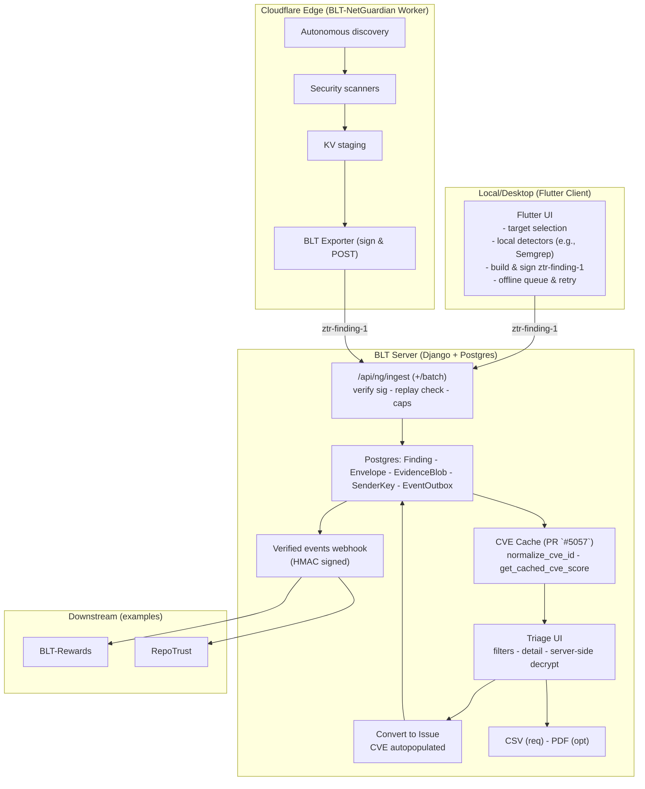

# NetGuardian — Technical approach & weekly deliverables (GSoC 2026)

> **Note for maintainers:** This is the technical part only. I'll add the SAT/personal sections (bio, coding skills, time commitment, etc.) once you're happy with this approach.

---

## 1. Introduction

This project extends work I've already contributed to OWASP BLT, including PR #5057 (CVE search, filtering, caching, autocomplete, and CVE-aware indexing on the Issue model), which is merged in the main repo. NetGuardian builds on that CVE layer and on the existing BLT-NetGuardian Worker (a Cloudflare Python Worker for autonomous discovery and scanning) to deliver a zero-trust ingestion path for security findings, CVE-aware triage, and verified events for downstream systems (Rewards, RepoTrust, University).

**Relationship to the existing BLT-NetGuardian Worker**

The Worker discovers targets (CT logs, GitHub API, blockchain) and runs security scanners (Web2, Web3, static, contract). Results stage in Cloudflare KV. This GSoC project doesn't rewrite the Worker. It connects that pipeline to BLT by:

- Adding a BLT exporter in the Worker that converts scan results to signed ztr-finding-1 envelopes and POSTs to BLT.
- Building BLT ingestion (/api/ng/ingest) with replay protection and Postgres storage.
- Enriching findings via the PR #5057 CVE cache.
- Adding a triage UI and "Convert to Issue".
- Emitting HMAC-signed verified events for downstream.

The split is clean: the Worker handles discovery, scanning, and KV; BLT handles ingestion, triage, CVE enrichment, Issue creation, and events.

NetGuardian as a whole also includes a Flutter desktop client that lets users run the Worker locally on their own machines and send findings into BLT through the same signed ingestion API. In this proposal I focus on the server/Worker pipeline, but I'll keep the Flutter client as a first-class entry point when designing APIs, auth, and UX.

Non-goals for the GSoC core scope include shipping the full Flutter desktop client; instead, I'll stabilize the ingestion contract, auth, and size caps so the Flutter app can integrate cleanly as a companion deliverable.

**Prerequisites verified**

- Python 3.11+, Django 5.x dev environment.
- Access to the BLT main repo and BLT-NetGuardian Worker repo.
- Cloudflare Workers CLI (wrangler) for local Worker testing.
- PostgreSQL 14+ for local schema and management command testing.

---

## 2. Architecture, stack & key files

Worker already exists; GSoC adds the Exporter and all BLT-side pieces. Flow: Worker to KV to Exporter to signed envelopes to ingestion to CVE enrichment to triage UI to "Convert to Issue" to HMAC-signed webhook. No new queue; existing throttling only.

**Stack**

- BLT server: Django 5.x, Django REST Framework, PostgreSQL.
- Worker: Cloudflare Python Worker (existing, for autonomous scanning and KV storage).
- Client: Flutter desktop app that runs NetGuardian locally and talks to the BLT ingestion API.

**Architecture split**

- Detection and scanning: already implemented in BLT-NetGuardian Worker, no new detector code in GSoC scope.
- Ingestion API: new DRF endpoints in BLT (/api/ng/ingest, /api/ng/ingest/batch) reusing existing auth patterns (TokenAuthentication, org-scoped permissions, throttling middleware).
- Triage UI: server-rendered templates with HTMX, reusing existing BLT frontend patterns.
- Flutter client: runs NetGuardian locally and submits findings via the same ztr-finding-1 envelopes; main client implementation can evolve in parallel, but APIs/auth/flows are designed here so it's a first-class entry point.
- No new infrastructure: no Celery, no separate worker daemons, no new queue systems. Periodic management commands (cron/Kubernetes CronJob) where needed; existing throttling middleware for rate limits.

**Key files**

- Worker (existing): src/worker.py, src/scanners/*.py, src/models/*.py, ARCHITECTURE.md, API.md.
- BLT (existing): website/cache/cve_cache.py (PR #5057) for normalize_cve_id() and get_cached_cve_score(); website/models.py for Issue.cve_id and Issue.cve_score; blt/middleware/throttling.py and blt/middleware/ip_restrict.py for rate limiting and IP controls; website/views/user.py for the HMAC pattern used by GitHub webhooks.
- BLT (new): website/netguardian/ (models, views, templates for Finding, Envelope, EvidenceBlob, EventOutbox, triage UI, and ingestion endpoints).

**Local Flutter client (desktop companion)**

Goal: Let users run NetGuardian locally (Windows/macOS/Linux) with a simple UI and send signed findings to BLT, so the pipeline scales globally without everyone needing to self-host BLT.

Responsibilities (MVP): run a small local "agent" flow: select target(s), run curated detectors (for example Semgrep via bundled or runtime install), review a preview, then send. Build ztr-finding-1 envelopes, HMAC-SHA256 sign them with org-scoped sender credentials, and POST to BLT /api/ng/ingest (or /api/ng/ingest/batch when available). Provide an offline queue and retry for flaky networks, with evidence size caps and redaction toggles before send. Keep minimal local history and link back to BLT triage for deep review.

Interfaces used: POST /api/ng/ingest and POST /api/ng/ingest/batch; org-level sender_id / kid / secret obtained from BLT; ztr-finding-1 envelope spec (same as the Worker and any CLI/CI agent).

Packaging: Flutter desktop app (Windows/macOS/Linux) with an auto-update channel and optional portable mode.

Scope note: The Flutter client is a companion deliverable for adoption at scale. Its development can proceed in parallel and is not required to land the core GSoC server milestones (ingestion, triage, CVE enrichment, events). I'll keep the server-side contracts stable so the Flutter client can integrate at any time.

---

## 3. Security invariants and design (ztr-finding-1)

Every envelope must carry version, sender_id, kid (Key ID), issued_at (RFC 3339 UTC timestamp), nonce, alg, payload_digest, signature, and exactly one payload: either payload_ciphertext (base64) or payload_plaintext (JSON object) with plaintext_mode=true. Sign over the canonical JSON of the envelope with the signature field omitted (RFC 8785-style key ordering; UTF-8; no extra whitespace). kid is part of the signed canonical document alongside version, sender_id, alg, and the rest — it is never header-only, so it cannot be swapped without invalidating the signature.

alg MUST be "hmac-sha256" for v1; "ed25519" may be added post-v1.

If plaintext_mode is true, the envelope MUST include payload_plaintext (JSON object). If plaintext_mode is false or absent, the envelope MUST include payload_ciphertext (base64). In both cases, payload_digest = sha256(payload_bytes) over the exact bytes sent — ciphertext bytes or the UTF-8 canonical JSON of payload_plaintext.

Signatures are HMAC-SHA256 over canonical JSON, chosen because it works natively in Cloudflare Workers without heavy crypto dependencies. Nonces MUST be unique per sender_id. The server enforces unique(sender_id, nonce) in the database and rejects replays within a ±5-minute issued_at window. Recommended nonce format: <unix_ts>-<random> (ordering is not required; uniqueness is). Ed25519 is on the table for future BLT-side verification but isn't needed for the Worker in this project.

For evidence, NetGuardian stores the encrypted bytes at rest (server-side keys), plus the SHA-256 digest and size. Neither ciphertext nor plaintext is ever logged, and templates/logs redact long or sensitive fields. Inbound inputs are normalized and length-capped before they touch anything. Max envelope body size: 1 MiB (1,048,576 bytes) by default (org-configurable); requests exceeding the cap are rejected with 413 Payload Too Large. All Finding reads are org-scoped at the query level, evidence access requires an explicit permission check and gets logged every time, and "Convert to Issue" enforces both org ownership and rate limits before it goes through.

These invariants are treated as contracts: tests are written against them, and any refactor or library change has to preserve them.

---

## 4. 12-week implementation plan (phases 1-16)

| GSoC Week | Focus (phases) |
|-----------|----------------|
| 1 | Phases 1–2: envelope/schema + ingestion and zero-trust |
| 2 | Phase 3: BLT Exporter integration (Worker → BLT) |
| 3 | Phase 4: Triage-lite UI (list/detail, perms, decrypt, Convert to Issue) |
| 4 | Phases 5–6: CVE plumbing (PR #5057 reuse) + validation/dedup |
| 5 | Phase 7 + Phase 8 start: CVE-aware UX + polish |
| 6 | Phase 8: triage polish, RFIs, midterm E2E demo |
| 7 | Phase 9: Worker→BLT fidelity & acceptance gates |
| 8 | Phase 10: consensus & resilience (quotas, 429/Retry-After) |
| 9 | Phase 11: remediation & insights (static fragments + OWASP links) |
| 10 | Phase 12: disclosure helpers & reports (CSV req; PDF opt/timeboxed) |
| 11 | Phase 13: verified events/webhooks + read-only events API |
| 12 | Phases 14–16: hardening, pilot, docs, v1.0 tag |

Phase 5 is fast (~2 days) because it reuses the existing CVE cache utilities from PR #5057. It is paired with Phase 6 in Week 4 to keep the 12-week timeline realistic. Phase numbers are implementation milestones, not weeks; the table above shows how 16 named phases map onto 12 GSoC weeks. The Flutter desktop client proceeds as a parallel companion deliverable against the stable ingestion contract.

**Phase 1 — Envelope and schema**

This week is about locking the envelope format and data model so everything that follows has a clear contract: a written ztr-finding-1 spec covering fields, signatures, timestamps, and nonces; database/ORM models for Finding, Envelope, EvidenceBlob, and SenderKey with migrations applied and everything wired into admin; a key registry model (per-org/per-sender) with kid for rotation and a clear approach to nonce uniqueness, either a DB table or a cache-key pattern, decided and documented; pagination defaults and a DB index strategy written down now; and serializer stubs for Finding/Envelope with unit tests covering model constraints and validation.

**Phase 2 — Ingestion and zero-trust**

Here we make the ingestion path real: a working ingestion API (/api/ng/ingest) that verifies signatures and timestamps server-side; solid replay protection with Envelope unique on (sender_id, nonce), clock skew capped at ±5 minutes, received_at/validated_at stored, and anything expired or replayed rejected cleanly; TokenAuthentication with per-org scoping, body size caps (≤1 MiB), and rate limits wired into the existing throttling middleware.

Headers: Content-Type: application/json; X-BLT-Signature: sha256=\<hex\>; X-BLT-Timestamp: \<unix_ts\>.

Responses:
- 201 Created: `{ finding_id, status: "created" | "merged", evidence_id, replay: false }`
- 200 OK (replay): `{ status: "duplicate", replay: true }`
- 400 Bad Request: `{ error: "clock_skew" | "digest_mismatch" | "bad_sig" | "invalid_envelope" }`
- 401 Unauthorized, 413 Payload Too Large, 429 Too Many Requests (with Retry-After header).

Batch endpoint: POST /api/ng/ingest/batch returns 207 Multi-Status with an array of per-item results `{ index, status: "created" | "merged" | "duplicate" | "error", finding_id?, evidence_id?, error_code? }`. Client retries only items with status="error".

Property tests cover the signature window, log redaction, and idempotency, plus one E2E test proving a valid envelope actually ends up as a stored Finding.

**Phase 3 — BLT Exporter integration**

The Worker gets a BLTExporter class (src/exporters/blt_exporter.py) that maps ScanResult to ztr-finding-1 envelopes, signs with HMAC-SHA256 using Cloudflare Workers stdlib, and POSTs to BLT with retry/timeout. An integration point in src/worker.py via handle_result_ingestion() calls the exporter after KV storage, best-effort, so the Worker keeps going if BLT is unreachable. Cloudflare secrets configured: BLT_INGEST_URL, SENDER_ID, KID, SENDER_SECRET. End-to-end test: Worker scan to KV to BLT exporter to BLT dev server to Finding row in Postgres.

**Phase 4 — Triage-lite UI**

A Finding list view with severity/rule/target filters, pagination, and sort; a detail view that decrypts evidence server-side, gates it behind explicit permissions, logs every access, and renders it in redacted form; a "Convert to Issue" flow wired to the BLT Issue model (CVE columns come later); org-scoped permissions enforced throughout; basic template or browser tests for list and detail.

**Phase 5 — CVE intelligence**

Findings (or linked Issues) populated with cve_id and cve_score using normalize_cve_id and get_cached_cve_score from website/cache/cve_cache.py; CVE columns surfaced in both triage list and detail views; mapping tests only, cache-miss fallback already covered by the existing suite.

**Phase 6 — Validation and dedup**

A fingerprint defined as (rule_id, target_url, optional selector, evidence_digest) with a unique DB index; idempotent submission that upserts by fingerprint so new evidence attaches to an existing Finding instead of creating a duplicate; a confidence score field (Decimal [0, 1]) and optional FP checklist fields on Finding; tests covering duplicate collapse, evidence attachment rollup, and concurrent submission races.

**Phase 7 — CVE-aware triage UX**

Finding list filters for cve_id, cve_score_min, and cve_score_max; a "Related CVEs" side panel rendered server-side from the existing CVE index; CVE autocomplete reused in the "Convert to Issue" flow; UI tests confirming filters interact correctly and the related CVE list and autocomplete behave as expected.

**Phase 8 — Triage polish and RFI**

A noticeably better evidence viewer with improved layout and syntax highlighting; canned RFI templates as markdown/callout partials; tests confirming templates don't leak secrets and render safely; midterm checkpoint: a full E2E demo, Worker scan to BLT Exporter to signed ingestion to Finding to triage list to server-side decrypt to "Convert to Issue" with CVE autopopulated.

**Phase 9 — Fidelity and acceptance gates**

Five to eight curated fixtures with known expected outcomes; a management command in BLT that queries the Worker /api/vulnerabilities endpoint and compares results against expected fixtures, persisting per-fixture metrics; documented acceptance gates: at least 95% ingestion success rate; at least 90% CVE match on known CVEs. Scope is pipeline integrity and CVE enrichment accuracy, not scanner rule tuning.

**Phase 10 — Consensus and resilience**

A reconfirmation gate for critical-severity findings (a second heuristic or rule has to agree before "Convert to Issue" goes through); confidence scoring updated to factor in reconfirmation; per-org/hour quotas via DB counters hooked into the existing throttling and IPRestrictMiddleware; batch ingestion stays in DB transactions only, no new queue; tests for the reconfirmation gate and for 429/Retry-After behavior under load.

**Phase 11 — Remediation and insights**

Markdown remediation fragments for each rule type with OWASP links, static content only; CVE-based enrichment when cve_id is present: advisory links and OWASP context so reviewers don't have to leave the page; "Why this matters" callouts and remediation hints surfaced in the triage detail view and report output; tests confirming fragments render safely and map correctly to the right rules and CVEs.

**Phase 12 — Disclosure helpers and reports**

security.txt detection integrated into "Convert to Issue" and the report flow so disclosure contacts surface automatically; CSV export for findings with CVE metadata included with snapshot tests confirming sensitive evidence does not leak; PDF export (WeasyPrint, timeboxed to 0.5–1 week) with the same redaction guarantees.

**Phase 13 — Verified events for downstream**

An EventOutbox table with a versioned payload schema (cve_id, cve_score, rule_id, severity, org_id/repo, finding_id/issue_id, created_at, dedupe_key, version); webhook delivery signed with HMAC-SHA256 reusing BLT's existing patterns from website/views/user.py, emitted on "Convert to Issue" and on resolution, with idempotency key and exponential backoff; a read-only API for event retrieval with pagination and filtering, plus consumption docs for Rewards and RepoTrust; tests covering event emission, idempotency, payload shape, and webhook signature verification.

**Phase 14 — Hardening and security review**

A full review pass: key handling, nonce uniqueness, evidence redaction in logs and templates, permission checks everywhere, and cache-poisoning resistance; dead code and over-generalized code cleaned out; docs updated to reflect what is actually implemented; a checklist or short report summarizing what was reviewed and what was fixed.

**Phase 15 — Pilot prep and docs**

A pilot checklist covering configuration steps, runbooks, and a rollback plan; a migration rollback note and data deletion playbook for evidence blobs; user, admin, setup, and contribution docs polished and reviewed end-to-end.

**Phase 16 — Pilot run and final polish**

A live pilot with one to two orgs with real metrics collected: time-to-triage, FP/FN feedback, and how useful the CVE filters and reports actually are in practice. High-priority fixes applied based on feedback, v1.0 tagged, and a short "what was delivered" summary ready for the GSoC final report.

---

## 5. Flexibility and change management

NetGuardian is designed to stay flexible for maintainers and the community. If we collectively decide mid-project that a different library or pattern makes more sense, I'll isolate third-party dependencies behind small wrappers so swapping them doesn't ripple through callers. Any non-trivial change gets a short Markdown note first (what, why, alternatives, schedule impact) before I touch anything. The acceptance criteria in this proposal (ingestion invariants, fidelity gates, verified-event schema) act as contracts; if we refactor, the tests stay the same and still have to pass.

---

## 6. Testing strategy (beyond PR #5057)

The ingestion tests cover the full envelope lifecycle: valid submission, expired timestamp, future-issued, and replay, with the replay case exercised via DB uniqueness so it holds under concurrent load rather than just in a single-threaded test. Signature mismatch and canonicalization drift are tested separately because they're easy to conflate. Size and MIME cap enforcement, filename sanitization, and access logging on evidence reads each get their own cases.

For the exporter, the main test is the full Worker to BLT E2E path. Beyond that: retry behavior when BLT is down, idempotency via nonce reuse, and how the exporter handles a malformed scan result without taking the Worker down with it.

Dedup tests focus on the fingerprint: the same fingerprint should collapse into one Finding, and concurrent submissions of the same fingerprint should also collapse cleanly rather than racing to create duplicates.

On the triage side: pagination boundaries, org permission leakage (Org A user cannot see Org B findings), CVE filter correctness reusing the normalize_cve_id and cache paths from PR #5057, and basic cache-poisoning resistance. For consensus and resilience: the critical reconfirmation gate and 429/Retry-After behavior under load. For reports: CSV and PDF snapshot tests that confirm sensitive evidence does not appear in plain text output.

---

## 7. Milestone checkpoints

- Midterm (after Phase 8): E2E demo — Worker scan to BLT Exporter to signed ingestion to Finding to triage list to server-side decrypt to "Convert to Issue" with CVE autopopulated.
- Final (after Phase 16): Full Worker to BLT pipeline live plus verified-events webhook plus fidelity metrics plus pilot feedback.

---

## 8. Cross-project integration

NetGuardian emits a signed webhook for Verified Events with a stable, versioned schema. I'll write concrete consumption examples specifically for BLT-Rewards and RepoTrust, not just the schema, but working examples so they're not guessing at edge cases. NetGuardian stops at emitting clean events; downstream scoring, gamification, and education logic are out of scope and should not live here.

Both the envelope and event payloads carry a version field and a dedupe_key for idempotent consumption. Webhook signing reuses the existing HMAC helpers from website/views/user.py, the same pattern BLT already uses for GitHub webhooks, so there is no new signing infrastructure to maintain. Webhook HMAC header: X-BLT-Webhook-Signature: sha256=\<hex\>; X-BLT-Webhook-Timestamp: \<unix_ts\>.

---

## 9. AI tooling

**IDE (fixed) and models (tentative)**

- IDE: Cursor.
- Strong reasoning (architecture, threat modeling, tricky refactors): Claude Opus 4.5, used when design choices and edge cases matter.
- Fast edits and boilerplate: Claude Sonnet 4.5, used for inline edits, serializers, migrations, docstrings, type hints, and repetitive scaffolding.
- Second opinion on security-sensitive code and docs: GPT-5.2, used to double-check ingestion, signing, nonce handling, permissions, and evidence redaction.

**How AI is used across phases**

Claude Opus 4.5 is used for the design-heavy phases where architecture choices and edge cases matter most: locking the ztr-finding-1 spec (Phase 1), thinking through reconfirmation gate tradeoffs before implementation (Phase 10), exploring payload shape options for the downstream event schema (Phase 13), and reasoning through failure modes in the midterm test plan (Phase 8). These are the places where getting the design right before coding saves significant rework.

Claude Sonnet 4.5 handles the high-volume repetitive work: serializer and DRF view boilerplate (Phase 2), ScanResult-to-envelope field mapping and retry utilities (Phase 3), template markup and filter form wiring (Phase 4), mapping tests and migration boilerplate (Phase 5), dedup and concurrent upsert test scaffolding (Phase 6), UX copy and filter labels (Phase 7), RFI template markdown prose (Phase 8), fixture generation for acceptance gates (Phase 9), rate-limit test structure (Phase 10), remediation prose for each rule type (Phase 11), export templates and snapshot test harnesses (Phase 12), model/serializer/doc boilerplate for the event schema (Phase 13), security review checklists (Phase 14), runbook and pilot checklist drafts (Phase 15), and the final GSoC report summary (Phase 16).

GPT-5.2 is reserved for security review of critical paths: the finished BLT exporter for secret handling and failure behavior (Phase 3), timestamp/nonce/signature handling and error paths in the ingestion layer (Phase 2), any security-critical changed code before final merge (Phase 14), and patches with security implications before the v1.0 tag (Phase 16).

**Guardrails**

Every security-critical path (ingestion, signing, nonce handling, permissions, evidence redaction) gets hand-reviewed and test-covered before it merges. AI is useful for drafts and suggestions, but nothing ships that isn't fully understood. The canonical JSON construction and HMAC signing are written from scratch; the verification logic, replay check, and size caps in the ingestion layer are also written directly rather than generated. AI-assisted security-sensitive code gets a GPT-5.2 review before merge as a second set of eyes, not a substitute for the primary review.
