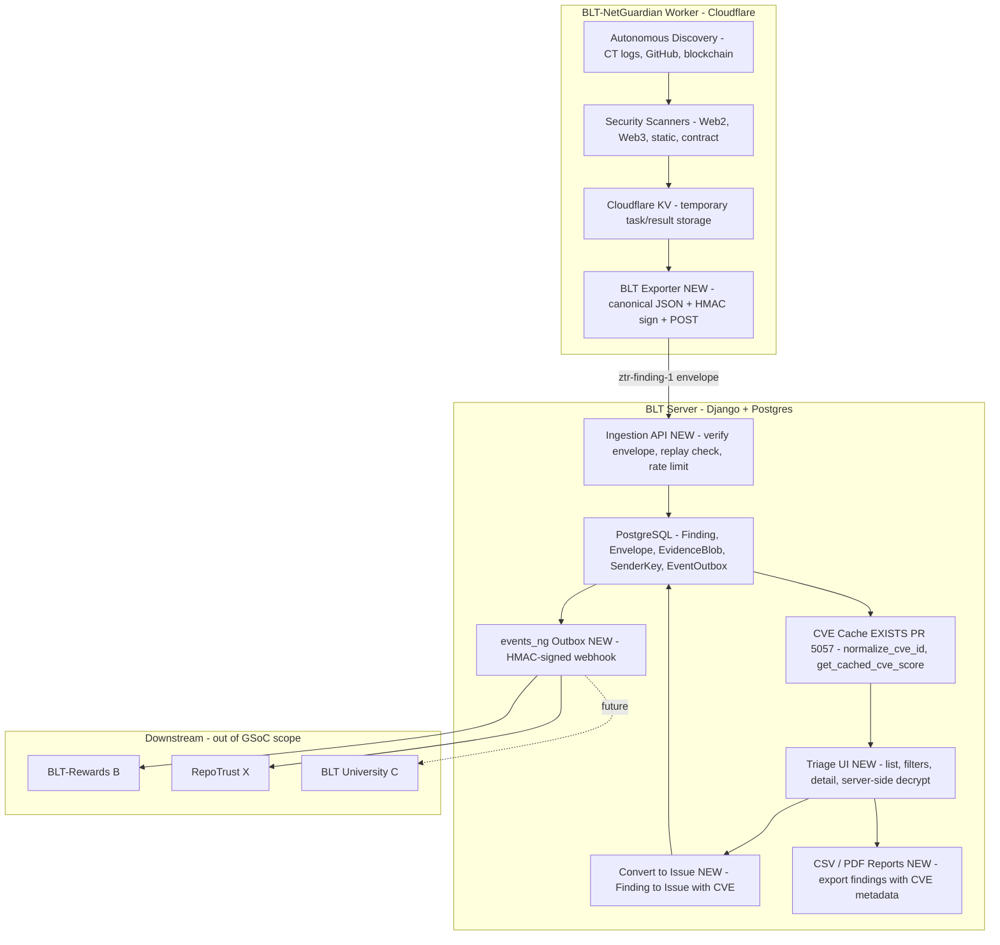

# NetGuardian — Technical approach & weekly deliverables (GSoC 2026)

> **Note for maintainers:** This is the **technical part only**. I'll add the SAT/personal sections (bio, coding skills, time commitment, etc.) once you're happy with this approach.

---

## 1. Introduction

This project extends work I have already contributed to OWASP BLT, including **PR #5057** (CVE search, filtering, caching, autocomplete, and CVE-aware indexing on the Issue model), merged in the main BLT repo. NetGuardian builds on that CVE layer and on the existing **BLT-NetGuardian Worker** (Cloudflare Python Worker for autonomous discovery and scanning) to deliver a zero-trust ingestion path for security findings, CVE-aware triage, and verified events for downstream systems (Rewards, RepoTrust, University).

### Relationship to the existing BLT-NetGuardian Worker

The [BLT-NetGuardian Worker](https://github.com/Pritz395/BLT-NetGuardian) discovers targets (CT logs, GitHub API, blockchain) and runs security scanners (Web2, Web3, static, contract). Results stage in Cloudflare KV. **This GSoC does not rewrite the Worker.** It connects that pipeline to BLT by: (1) adding a BLT exporter in the Worker that converts scan results to signed `ztr-finding-1` envelopes and POSTs to BLT; (2) building BLT ingestion (`/api/ng/ingest`) with replay protection and Postgres storage; (3) enriching findings via PR #5057 CVE cache; (4) adding a triage UI and "Convert to Issue"; (5) emitting HMAC-signed verified events for downstream. **Split:** Worker = discovery + scanning + KV; BLT = ingestion + triage + CVE + Issue creation + events.

---

## 2. Architecture overview

**Legend (downstream):** B = BLT-Rewards; X = RepoTrust; C = BLT-University.

Worker already exists; GSoC adds the Exporter and all BLT-side pieces. Flow: Worker → KV → Exporter → signed envelopes → ingestion → CVE enrichment → triage UI → "Convert to Issue" → HMAC-signed webhook. No new queue; existing throttling only.

**12-week mapping:**

| Week | Delivers |
|------|----------|
| 1 | Envelope schema + DB (Finding, Envelope, EvidenceBlob, SenderKey) + ingestion API, replay protection, auth |
| 2 | BLT Exporter in Worker + E2E Worker → BLT test |
| 3 | Triage list/detail + permissions + server-side decrypt + "Convert to Issue" sketched |
| 4 | CVE plumbing (PR #5057) + validation & dedup (fingerprint, confidence) |
| 5 | CVE-aware triage UX + evidence viewer polish start |
| 6 | Evidence viewer + RFI templates + midterm E2E demo |
| 7 | Worker → BLT fidelity suite + acceptance gates (≥95% ingestion, ≥90% CVE match) |
| 8 | Consensus/reconfirmation for criticals + quotas & resilience |
| 9 | Remediation fragments + "why this matters" in triage and reports |
| 10 | security.txt + CSV (required); PDF (optional) |
| 11 | events_ng outbox + HMAC webhook + read-only events API |
| 12 | Hardening + pilot prep + pilot run + v1.0 |

---

## 3. Stack & scope

Django 5.x + DRF + Postgres on BLT; Cloudflare Python Worker (existing) for scanning. Detection stays in the Worker; GSoC adds DRF ingestion (`/api/ng/ingest`, `/api/ng/ingest/batch`), triage UI (server-rendered, HTMX), and no new infra (no Celery, no new queues). Evidence: server-side decrypt, audited access. Reports: CSV required, PDF optional. Signatures: HMAC-SHA256 in Worker (stdlib only); Ed25519 optional later on BLT side. Security-critical code: hand-written from spec, tests required.

---

## 4. Community bonding (pre-Week 1)

Deliverables: a one-pager for `ztr-finding-1` (fields, signature, time window, nonce, key distribution); an adoption/readiness checklist (install modes, data boundaries); mentor sign-off on the v1 envelope, BLT Exporter interface, and "verified event" definition for downstream. Activities: re-review BLT and Worker code and PR #5057; draft and iterate the one-pager and checklist with mentors; map Worker `ScanResult` to envelope fields; document decisions.

---

## 5. Week-by-week plan (phases 1–16)

**Phase 1 — Envelope & schema**  
Written `ztr-finding-1` spec (detailed enough that someone else could implement without coming back with questions). DB/ORM models for Finding, Envelope, EvidenceBlob, SenderKey with migrations and admin. Key registry (per-org/per-sender, `kid` for rotation) and a clear nonce-uniqueness approach (DB or cache). Pagination defaults and DB index strategy for findings written down. Serializer stubs and unit tests for model constraints and validation.

**Phase 2 — Ingestion & zero-trust**  
Working `/api/ng/ingest` that verifies signatures and timestamps server-side. Replay protection: Envelope unique on `(sender_id, nonce)`, clock skew ±5 min, expired/replayed rejected. TokenAuthentication, per-org scoping, body cap ≤1 MB, rate limits via existing throttling. Property tests for signature window, log redaction, idempotency; one E2E test: valid envelope → stored Finding.

**Phase 3 — BLT Exporter integration**  
`BLTExporter` in Worker (`src/exporters/blt_exporter.py`): maps ScanResult to `ztr-finding-1`, signs with HMAC-SHA256 (stdlib), POSTs to BLT with retry/timeout. Integration in `src/worker.py` → `handle_result_ingestion()` after KV (best-effort). Secrets: BLT_INGEST_URL, SENDER_ID, KID, SENDER_SECRET. E2E: Worker scan → KV → exporter → BLT → Finding in Postgres.

**Phase 4 — Triage-lite UI**  
Finding list (severity/rule/target filters, pagination, sort) you can actually sit down and use. Detail view: server-side decrypt, permission-gated, access logged, redacted render. "Convert to Issue" sketched and wired to Issue model. Org-scoped permissions; basic tests for list/detail and permission leakage.

**Phase 5 — CVE intelligence**  
*CVE plumbing is quick (~2 days) reusing `website/cache/cve_cache.py` (PR #5057). Week 4 pairs Phase 5 with Phase 6 to keep the 12-week timeline.* Findings populated with `cve_id`/`cve_score` via `normalize_cve_id` and `get_cached_cve_score`. CVE columns in list and detail. Mapping tests only; no new NVD logic.

**Phase 6 — Validation & dedup**  
Fingerprint `(rule_id, target_url, selector?, evidence_digest)` with unique DB index. Upsert by fingerprint; new evidence attaches to existing Finding. Confidence score (0–1) and optional FP checklist. Tests: duplicate collapse, evidence rollup, concurrent submission.

**Phase 7 — CVE-aware triage UX**  
Filters: `cve_id`, `cve_score_min`/`max` (mirror Issue side). "Related CVEs" side panel from existing CVE index. CVE autocomplete in "Convert to Issue". UI tests for filters and related CVE panel.

**Phase 8 — Triage polish & RFI**  
Better evidence viewer (layout, syntax highlighting or snippet context). Canned RFI templates (markdown/callout) in detail view; tests for safe render and no secret leak. **Midterm:** full E2E — Worker → Exporter → ingestion → Finding → triage list → decrypt → "Convert to Issue" with CVE autopopulated.

**Phase 9 — Fidelity & acceptance gates**  
5–8 curated fixtures with known outcomes. BLT management command: query Worker `/api/vulnerabilities`, compare to fixtures, persist metrics (ingestion success %, CVE match). Gates: ≥95% ingestion success; ≥90% CVE match on known CVEs. Scope is pipeline integrity and CVE accuracy — not scanner tuning (Worker’s job).

**Phase 10 — Consensus & resilience**  
Reconfirmation gate for critical findings (second rule/heuristic must agree). Confidence scoring reflects reconfirmation. Per-org/hour quotas (DB counters) with existing throttling and IPRestrictMiddleware; batch ingestion in DB only, no new queue. Tests: reconfirmation and 429/Retry-After under load.

**Phase 11 — Remediation & insights**  
Markdown remediation fragments per rule type (OWASP links). CVE enrichment when `cve_id` present (advisory links). "Why this matters" and remediation in triage detail and reports. Tests: fragments render safely and map to rules/CVEs.

**Phase 12 — Disclosure & reports**  
security.txt detection in "Convert to Issue" and report flow. CSV export with CVE metadata; snapshot test for no sensitive evidence in plain text. PDF (e.g. WeasyPrint, timeboxed); same redaction guarantees.

**Phase 13 — Verified events**  
EventOutbox with versioned payload (cve_id, cve_score, rule_id, severity, org/repo, finding_id/issue_id, dedupe_key, version). Webhook HMAC-SHA256 (reuse `website/views/user.py` patterns) on "Convert to Issue" and resolution; idempotency and backoff. Read-only events API + consumption docs for Rewards (B) and RepoTrust (X). Tests: emission, idempotency, payload, signature.

**Phase 14 — Hardening**  
Security pass: key handling, nonce uniqueness, evidence redaction in logs/templates, permission checks, cache-poisoning resistance. Remove dead or over-generalized code; docs match implementation. Short checklist or report of what was reviewed and fixed.

**Phase 15 — Pilot prep**  
Pilot checklist (config, runbooks, rollback). Migration rollback and evidence-blob deletion playbook. User, admin, setup, and contribution docs polished; link to ztr-finding-1 and adoption checklist.

**Phase 16 — Pilot & final**  
Live pilot with 1–2 orgs; metrics: time-to-triage, FP/FN, usefulness of CVE filters and reports. High-priority fixes, v1.0 tag, "what was delivered" summary for GSoC final report.

---

## 6. Milestone checkpoints

- **Midterm (after Phase 8):** E2E demo — Worker scan → BLT Exporter → signed ingestion → Finding → triage list → server-side decrypt → "Convert to Issue" with CVE autopopulated.
- **Final (after Phase 16):** Full Worker → BLT pipeline live + verified-events webhook + fidelity metrics + pilot feedback.

---

## 7. Security invariants (ztr-finding-1)

Envelope: `version`, `sender_id`, `issued_at` (UTC), `nonce`, `signature`, `payload_digest`, `payload_ciphertext`|`plaintext_mode`, `alg`. Signature: HMAC-SHA256 over canonical JSON; ±300s skew rejected; nonces strictly monotonic per `sender_id`; `unique(sender_id, nonce)` in DB. Ed25519 optional later on BLT. Evidence: store digest and size only; max size and MIME limits; never log ciphertext/plaintext. Inputs: normalized, length-capped; logs redact secrets. Permissions: Finding reads org-scoped; evidence gated and access logged; "Convert to Issue" enforces org ownership and rate limits.

---

## 8. Tests (beyond PR #5057)

Envelope/ingestion: valid, expired, future, replayed; DB uniqueness; signature mismatch and canonicalization; size/MIME caps; access logging. Exporter: Worker → BLT E2E; retry on downtime; idempotency via nonce; malformed handling. Dedup: same fingerprint collapses; concurrent submissions. Triage: pagination; permission leakage; CVE filters and cache paths; cache-poisoning resistance. Consensus: reconfirmation gate; 429/Retry-After. Reports: CSV/PDF redaction and no plaintext secrets.

---

## 9. Cross-project integration

Signed webhook for Verified Events with stable, versioned schema; concrete consumption examples for BLT-Rewards and RepoTrust. No downstream scoring or education logic in NetGuardian. Version and dedupe_key in envelope and events; HMAC reuses BLT patterns (`website/views/user.py`) — no new signing infra.

---

## 10. Key files

**Worker (existing):** `src/worker.py`, `src/scanners/*.py`, `src/models/*.py`, `ARCHITECTURE.md`, `API.md`.  
**BLT:** `website/cache/cve_cache.py` (PR #5057), `website/models.py` (Issue.cve_id/cve_score), `blt/middleware/throttling.py` & `ip_restrict.py`, `website/views/user.py` (HMAC); **new:** `website/netguardian/` (models, views, templates).
