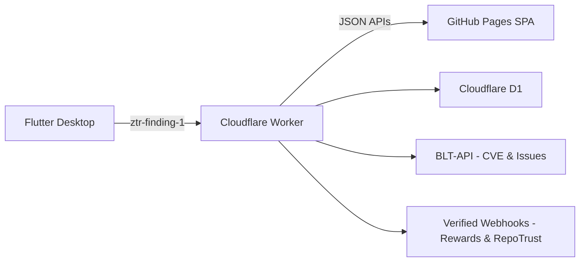

# NetGuardian — GSoC 2026 Technical Approach & Weekly Deliverables

**Note for maintainers:** This is the technical part only. I'll add the personal sections (bio, time commitment, availability, etc.) once you're happy with the approach.

**Scope note:** This GSoC scope doesn't add new Django endpoints, templates, or PostgreSQL models to the BLT main repo. All NetGuardian backend logic runs in Cloudflare Workers with D1, and the triage UI is a static app on GitHub Pages consuming Worker JSON APIs. CVE data and Issue creation are delegated to BLT-API.

---

## 1. Introduction

This proposal connects the existing BLT-NetGuardian autonomous Worker to BLT's triage and issue-tracking through a zero-trust ingestion path, CVE-aware triage, and verified downstream events. The idea itself was part of my core GSoC ideas initiative plan. It builds directly on my recent BLT contribution (PR #5057: CVE search, filtering, caching, autocomplete, and Issue model CVE columns) by enriching new security Findings with CVE metadata so triaging is faster.

**What This Enables:**
- Zero-trust ingestion for security findings with replay resistance and strict freshness
- CVE-aware triage at scale with server-side decrypt and audited access
- Verified, signed events for downstream programs (Rewards, RepoTrust)
- A first-class desktop app (Flutter) for local runs with envelope signing, offline queue, and retry
- A fully serverless footprint: GitHub Pages SPA + Cloudflare Worker + D1; no new Django/DRF endpoints or PostgreSQL migrations in BLT to ship v1; only minimal, non-breaking hooks if explicitly approved



The Worker already handles autonomous discovery (CT logs, GitHub, blockchain) and scanning (Web2, Web3, static, contract), staging results in KV. This project doesn't rewrite any of that. What it does:

- Adds a BLT exporter inside the Worker that builds and sends signed `ztr-finding-1` envelopes to a dedicated ingestion route
- Implements ingestion, triage APIs, CVE enrichment, dedup/idempotency, and verified events in Worker with D1 storage
- Serves a static triage SPA on GitHub Pages that calls Worker JSON APIs with no secrets on the client

**Prerequisites verified:** Cloudflare Workers + D1, GitHub Pages for SPA hosting, BLT-API endpoints for CVE normalization/score and Issue creation.

---

## 2. Architecture & Stack

The whole thing is serverless. The Worker (Python) handles all backend logic, D1 (SQLite) is the storage layer, and the triage UI is a static SPA on GitHub Pages. BLT-API takes care of CVE lookups and Issue creation. No Django, no PostgreSQL, no Celery. CORS is locked to GitHub Pages origins only.


The Worker does the heavy lifting: ingestion (`POST /api/ng/ingest` + `/batch`), triage list/detail APIs, server-side decrypt with audit logging, CVE enrichment, org-scoped auth via GitHub OAuth + PKCE, and outbox/webhooks. `X-BLT-Timestamp` is advisory for logs and rate-limiting only; `issued_at` inside the signed envelope is what governs expiry.

The SPA is just UI: list, filter, detail, CSV export, and the Convert to Issue button. No secrets, no decryption, no direct DB calls on the client. BLT-API handles CVE normalization/score, Issue creation, and optionally org/user membership checks.

D1 tables: `sender_keys`, `envelopes`, `evidence_meta`, `findings`, `events_outbox`, `access_logs` with unique indexes on `(org_id, sender_id, kid)`, `(sender_id, nonce)`, `(rule_id, target_url, selector, evidence_digest_sha256)`, and `dedupe_key`.

Endpoints: `/api/ng/ingest`, `/api/ng/ingest/batch`, `/api/ng/findings`, `/api/ng/findings/{id}`, `/api/ng/findings/{id}/convert`, `/api/ng/events`.

**Headers (ingest requests):**
```
Content-Type: application/json
X-BLT-Signature: sha256=<hex>
X-BLT-Timestamp: <unix_ts>
```

Ingestion returns `201` for created/merged, `200` for duplicates, `400` for bad_sig/clock_skew/digest_mismatch/invalid_envelope, `413` for oversized payloads, and `429` with Retry-After for rate limiting. Batch returns per-item `[{index, status, finding_id?, error_code?}]` and clients only retry `status="error"` items.

**Response bodies:**
- `201 Created`: `{ finding_id, status: "created" | "merged", evidence_id, replay: false }`
- `200 OK (duplicate)`: `{ status: "duplicate", replay: true }`
- `400/401/413/429`: `{ error: "clock_skew" | "digest_mismatch" | "bad_sig" | "invalid_envelope" }` (429 includes Retry-After)

Webhook headers: `X-BLT-Webhook-Signature: sha256=<hex>` and `X-BLT-Webhook-Timestamp: <unix_ts>`.

**Non-goals:** no Django/DRF endpoints or templates in BLT main repo, no PostgreSQL migrations, no heavy PDF pipeline by default (CSV required; PDF optional and timeboxed), evidence never touches logs in readable form.

**BLT main repo touch points (allowed when needed):**
Minimal, well-scoped changes in the BLT main repo are fine if integration requires them (e.g. a small permission hook or signal, narrow model tweaks, non-breaking API/webhook hooks). Any change needs to be narrowly scoped, approved by maintainers, documented, and covered by tests. No new heavy endpoints or large PostgreSQL models planned for v1.

**Flutter desktop client (core component):**
The Flutter desktop app (Windows/macOS/Linux) is a first-class deliverable: builds/sends signed `ztr-finding-1` envelopes (HMAC-SHA256) to `/api/ng/ingest`, offline queue + retry on flaky networks, minimal UI (target selection, preview, send, links back to triage SPA). Ships as part of v1, not optional.

---

## 3. Security Invariants (ztr-finding-1)

Every envelope needs these fields: `version` ("ztr-finding-1"), `sender_id`, `kid` (for key rotation), `alg` (must be `hmac-sha256` for v1, Ed25519 may come later), `issued_at` (RFC 3339 UTC), `nonce` (unique per `sender_id`), `payload_digest` (`hex(SHA-256(payload_bytes))`), `signature` (base64), and exactly one of `payload_ciphertext` (base64) or `payload_plaintext` (JSON with `plaintext_mode=true`). `payload_digest` has to be computed over the exact bytes sent, not a reformatted version.

Signing: canonical JSON with the `signature` field removed, keys sorted, no extra whitespace, UTF-8 encoded, then HMAC-SHA256 over those bytes compared with `hmac.compare_digest`. `X-BLT-Timestamp` is never trusted for security decisions, only `issued_at` inside the signed envelope is.

Replay/freshness: server enforces ±5 min window on `issued_at`. `UNIQUE(sender_id, nonce)` in D1 means duplicates get a `200 {status: "duplicate"}` back, not an error.

Evidence is AES-GCM encrypted at rest with a rotatable Worker-managed key stored in Cloudflare environment secrets. Each ciphertext stores a key version; rotation happens via re-encrypt-on-access or a background migration. The SPA only ever sees digests, sizes, or pointers. Every decrypt goes to `access_logs`. Nothing sensitive appears in logs. The 1 MiB cap applies to the entire HTTP request body as received over the wire; enforced with `413`, configurable per org.

All Finding queries are org-scoped. Convert-to-Issue checks org ownership first. Rate limits are per org. Nonce just needs to be unique per `sender_id`; recommended format is `"<unix_ts>-<random>"`.

---

## 4. 12-Week Implementation Plan

| Week | Focus |
|---|---|
| 1 | Spec + D1 schema + scaffolding |
| 2 | Ingestion verification, replay, caps |
| 3 | Auth + org scoping + /findings list |
| 4 | /findings/{id} + server-side decrypt + audit + permissions |
| 5 | CVE plumbing (BLT-API) + dedup/idempotency + CSV scaffold |
| 6 | Triage polish + RFIs + midterm E2E + blog post |
| 7 | Fidelity fixtures and acceptance gates |
| 8 | Consensus for criticals + quotas/back-pressure |
| 9 | Remediation and insights (static) |
| 10 | Disclosure helpers and reports |
| 11 | Verified events and minimal events API |
| 12 | Hardening, docs, pilot, v1.0 |

---

### Week 1 - Spec + D1 Schema + Scaffolding

Finalize the `ztr-finding-1` spec (fields, canonicalization, caps, errors). Create the D1 schema with all six tables and unique indexes. Set up the Worker project and CI skeleton. Write and test the canonicalization and digest utilities.

**Exit criterion:** Spec doc and D1 migrations committed, Worker repo with CI green, canonicalization and digest tests passing.

---

### Week 2 - Ingestion Verification, Replay, Caps

Implement `POST /api/ng/ingest` and `/batch`: signature verify, ±5 min skew enforcement, 1 MiB cap, DB uniqueness on `(sender_id, nonce)` with idempotent duplicate path, consistent error codes and JSON responses. Write property tests covering the main failure paths.

**Exit criterion:** `POST /api/ng/ingest` (+/batch) working with tests and docs, D1 constraints verified.

---

### Week 3 - Auth + Org Scoping + /findings List

- GitHub OAuth + PKCE in Worker; secure session cookie
- Org scoping and permission checks on list queries
- `/api/ng/findings` with filters/paging/sort; SPA list view (no detail yet)

**Exit criterion:** Login working, org-scoped list functional, permission boundaries tested.

---

### Week 4 - /findings/{id} + Server-side Decrypt + Audit + Permissions

- `/api/ng/findings/{id}` returns redacted metadata + server-side decrypted snippet
- Audit logging on every evidence view; enforce org membership and permission checks
- SPA detail view: redacted snippet, access audit indicator, "Convert to Issue" (stub)

**Exit criterion:** Detail and decrypt path working, audit log on every evidence view, org-scoped access enforced.

---

### Week 5 - CVE Plumbing (BLT-API) + Dedup/Idempotency + CSV Scaffold

- Integrate BLT-API `normalize_cve_id`/`get_cve_score`; store `cve_id`/`cve_score` on Finding; SPA CVE filters
- Enforce fingerprint uniqueness `(rule_id, target_url, selector?, evidence_digest)` with upsert semantics; concurrency tests
- CSV export endpoint with redaction; SPA "Export CSV" button; snapshot tests

**Exit criterion:** CVE enrichment and filters functional, dedup proven under concurrency, CSV export with redaction tests passing.

---

### Week 6 - Triage Polish + RFIs + Midterm E2E + Blog Post

Evidence viewer polish; canned RFI fragments; midterm E2E: login, ingest, triage, decrypt, Convert-to-Issue (BLT-API), verified event, CSV. Public technical blog post covering architecture, security invariants, integration approach, and lessons learned.

**Exit criterion:** E2E demo runs clean, midterm blog post published, midterm checkpoint passed.

---

### Week 7 - Fidelity Fixtures and Acceptance Gates

Build 5-8 curated fixtures with known expected outcomes (CVE IDs + severities). Persist ingestion and CVE enrichment metrics in D1. Enforce acceptance thresholds in CI (>=95% ingestion success, >=90% CVE match). Document the fixture procedure and regression checklist.

**Exit criterion:** Metrics pipeline live, thresholds enforced in CI.

---

### Week 8 - Consensus for Criticals + Quotas/Back-pressure

Consensus gate for criticals: auto-convert only if two or more signals corroborate, otherwise manual override. Update confidence scoring. Per-org/hour quotas and 429 with Retry-After. SPA handles back-pressure gracefully.

**Exit criterion:** Consensus gate on, quotas and 429 behavior solid, tests passing.

---

### Week 9 - Remediation and Insights (Static)

Map remediation fragments to `rule_id`s with OWASP links. Add "why this matters" callouts. Render safe static content in the SPA. Test rule-to-fragment mapping and confirm no XSS vectors.

**Exit criterion:** Remediation content live, safe rendering confirmed.

---

### Week 10 - Disclosure Helpers and Reports

Integrate `security.txt` detection into Convert-to-Issue and reports. Finalize CSV. PDF is optional and timeboxed to 0.5-1 week with the same redaction rules; deferred if it proves unstable.

**Exit criterion:** CSV and `security.txt` live, PDF only if timebox succeeds, tests green.

---

### Week 11 - Verified Events and Minimal Events API

Insert into `events_outbox` on convert/resolution with `version`, `dedupe_key`, and HMAC signature. Webhook delivery with HMAC headers, exponential backoff retries, and `dedupe_key` idempotency. Read-only `/api/ng/events` for consumers. Test signature verification, retry logic, idempotent delivery. Write example consumers and docs for BLT-Rewards and RepoTrust.

**Exit criterion:** Webhooks working with retries, events API documented and tested.

---

### Week 12 - Hardening, Docs, Pilot, v1.0

Security review: key handling, AES-GCM usage, nonce uniqueness, cache-poisoning resistance, permission paths, log redaction. Cron Triggers for retries/cleanup. WAF/rate-limit tuning. Pilot with 1-2 orgs, fix high-priority feedback, write the runbook and rollback/data deletion docs. Tag v1.0.

**Exit criterion:** v1.0 tagged, full pipeline live, pilot metrics published, final report submitted.

---

## 5. Flexibility and Change Management

Worker modules (ingestion, triage, CVE, events) are kept thin and test-covered so swapping implementations doesn't ripple across the SPA or schema. All externally visible contracts (envelope `ztr-finding-1`, ingest/webhook headers, events payload) are versioned and tests enforce the invariants. Any non-trivial change ships with a short ADR-style note covering what, why, alternatives considered, and schedule impact.

---

## 6. Testing Strategy

**Envelope/ingestion:** Valid/expired/future/replayed envelopes, duplicate idempotency, signature mismatch, canonicalization stability, 1 MiB cap, consistent error codes, no plaintext in logs.

**Dedup/idempotency:** Same fingerprint collapses to one Finding, variant `evidence_digest` creates new attachment, concurrent races resolve correctly.

**Triage and permissions:** Org scoping and leakage negatives, pagination/sort, evidence access always audited, CVE filter correctness, cache-poisoning resistance.

**Consensus and resilience:** Critical reconfirmation gate, quotas, 429 Retry-After honored end-to-end.

**Reports:** CSV snapshot tests with no plaintext secrets; PDF snapshot tests if implemented with same redaction guarantees.

**Metrics/fidelity:** Worker to BLT ingestion success and CVE match thresholds enforced in CI.

---

## 7. Milestone Checkpoints

**Midterm (end of Week 6):** E2E demo: signed ingestion, D1 Finding, CVE-aware triage list/detail, server-side decrypt (audited), Convert-to-Issue (BLT-API), verified event queued, CSV export.

**Final (end of Week 12):** Productionized Worker + D1 + SPA, verified events/webhooks, curated metrics, pilot feedback applied, v1.0 tagged, docs and runbooks shipped.

---

## 8. Cross-project Integration

**BLT-API:** `normalize_cve_id`/`get_cve_score` and Issue creation. Optional org/user membership check.

**Downstream consumers:** HMAC-signed verified events (versioned, with `dedupe_key`) and a minimal read-only events API for polling. Example consumers for BLT-Rewards and RepoTrust included in docs. Downstream logic stays out of NetGuardian.

**Webhook contract:** Both envelope and event payloads carry `version` and `dedupe_key` for idempotent consumption. Webhook HMAC headers: `X-BLT-Webhook-Signature: sha256=<hex>` and `X-BLT-Webhook-Timestamp: <unix_ts>`.

---

## 9. AI Tooling and Safety

**IDE:** Cursor.

**Models:**
- Claude Opus 4.5 for design-heavy phases: `ztr-finding-1` spec, reconfirmation gate tradeoffs, events payload shape, midterm failure modes
- Claude Sonnet 4.5 for repetitive scaffolding: Worker handlers, SPA filters/UI, D1 queries, UX copy, RFI prose, fixtures, rate-limit tests, remediation fragments, CSV/PDF snapshot tests, events docs, checklists, runbooks, final summary
- GPT-5.2 as a second opinion on security-sensitive code: secrets/failure behavior in the exporter, timestamp/nonce/signature error paths, security-impacting patches

**Guardrails:** Security-critical code (envelope verification, canonicalization, signing, nonce handling, server-side decrypt, permission checks) is hand-written from the spec and covered by tests. No unreviewed AI generation in these paths. AI assistance is limited to boilerplate, documentation, and fixtures. All changes pass code review and test gates. Invariants are codified in tests; refactors must preserve them.
